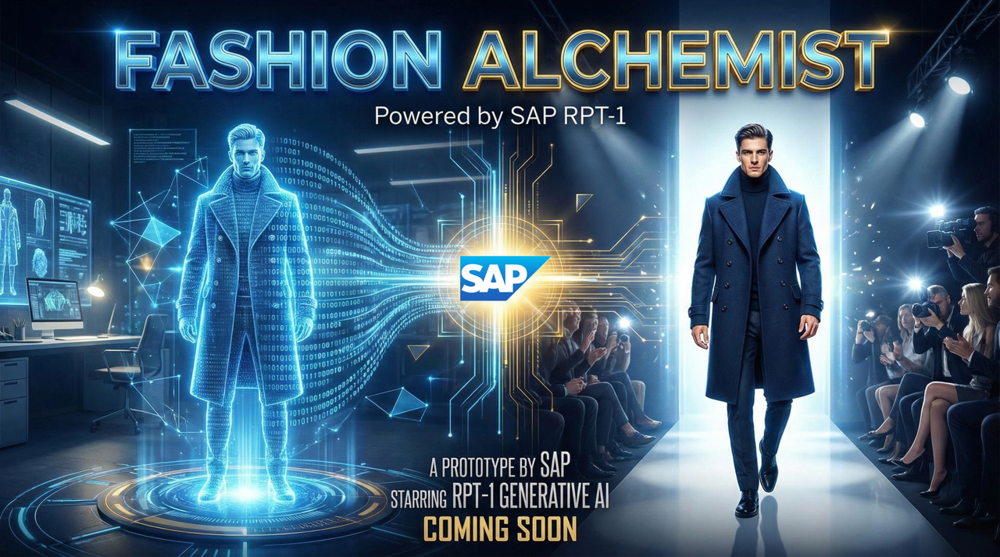
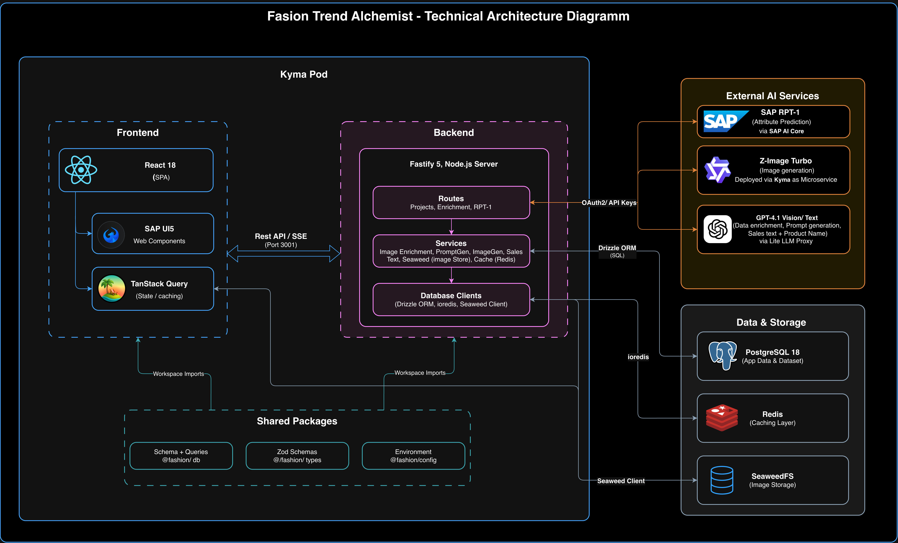
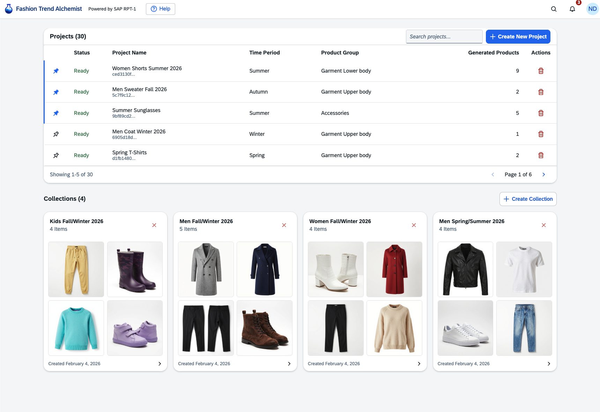
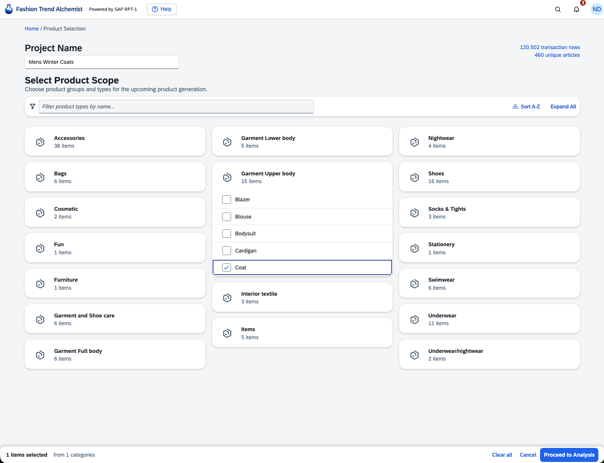
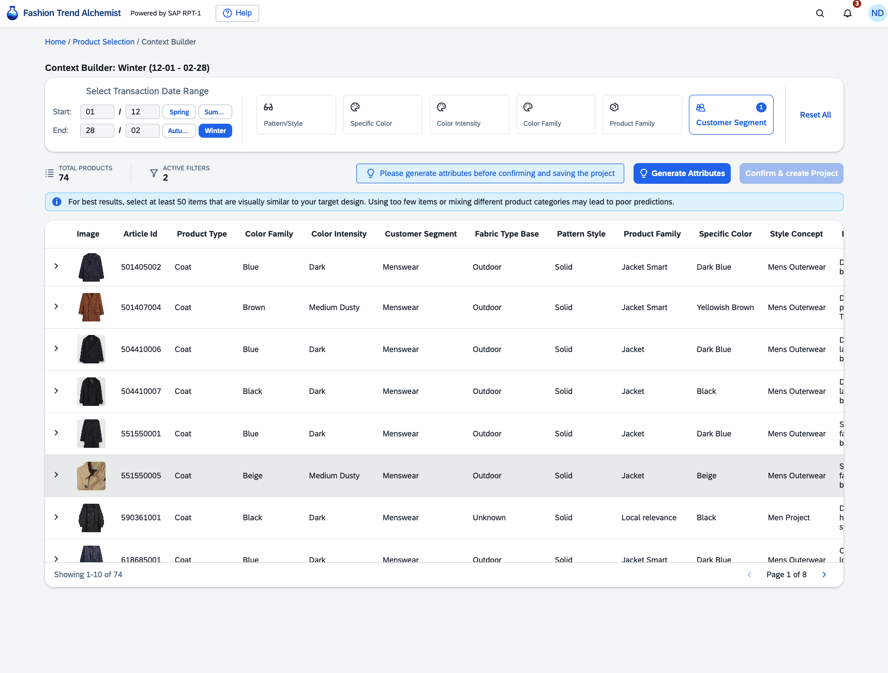
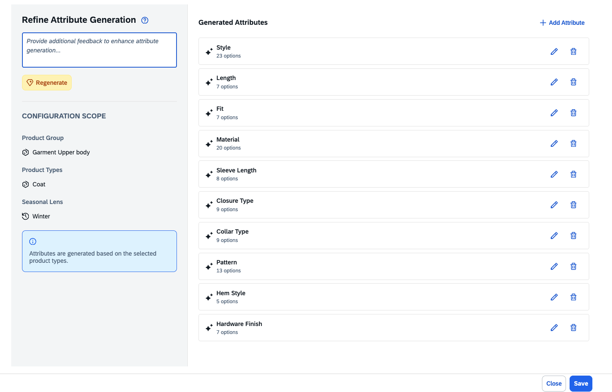
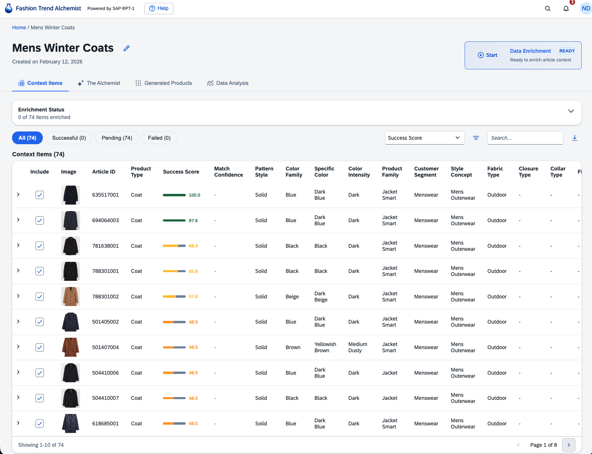
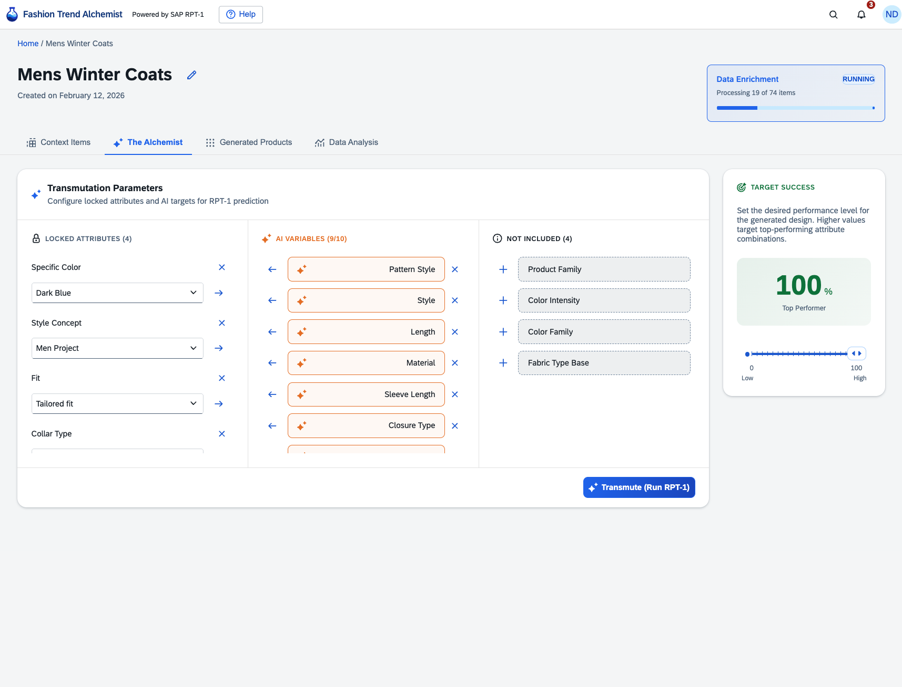
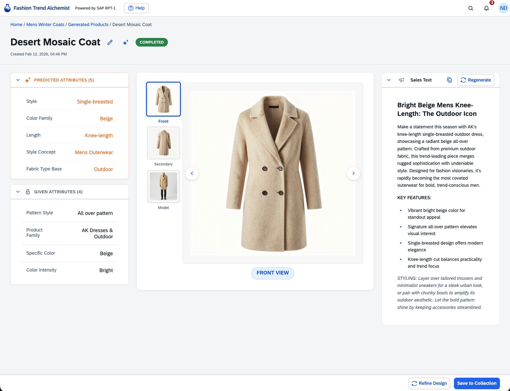

<div align="center">
  
  
  <p align="center">
    <strong>AI-Powered Inverse Design Workstation for Fashion Analytics</strong><br/>
    <em>Leveraging SAP AI Core, SAP Kyma, and Enterprise AI to predict future best-sellers</em>
  </p>
  
  <p align="center">
    <a href="#about">About</a> •
    <a href="#system-visualization">System Visualization</a> •
    <a href="#architecture">Architecture</a> •
    <a href="#getting-started">Getting Started</a> •
    <a href="#features--screenshots">Features</a> •
    <a href="#sap-technology-integration">SAP Technologies</a> •
    <a href="#deployment">Deployment</a> •
    <a href="#documentation">Documentation</a>
  </p>
  
  <p align="center">
    
    
    
    
    
    
    
  </p>
</div>

---

# Table of Contents

- [About](#about)
- [System Visualization](#system-visualization)
- [Architecture](#architecture)
  - [Technical Architecture](#technical-architecture)
  - [Monorepo Structure](#monorepo-structure)
  - [Technology Stack](#technology-stack)
- [Getting Started](#getting-started)
  - [Prerequisites](#prerequisites)
  - [Quick Setup](#quick-setup)
- [Features & Screenshots](#features--screenshots)
- [SAP Technology Integration](#sap-technology-integration)
- [Database Schema](#database-schema)
- [API Reference](#api-reference)
- [Deployment](#deployment)
- [User Workflows](#user-workflows)
- [Documentation](#documentation)
- [Troubleshooting](#troubleshooting)

---

# About

**Fashion Trend Alchemist** is a TypeScript-based AI-powered fashion analytics platform that combines historical sales data analysis with cutting-edge machine learning to generate design attributes for future best-sellers. Built on SAP's enterprise technology stack, it provides a complete inverse design workstation for fashion professionals.

## Project Status

✅ **All development phases are complete.** This application is a fully functional AI-powered inverse design workstation.

**Implemented Features:**

- **Phase 1**: Product Analysis - Taxonomy browsing, context builder with advanced filtering
- **Phase 2**: LLM-based Attribute Enrichment - Vision LLM extracts structured attributes from images
- **Phase 3**: RPT-1 Inverse Design Engine - Three-column attribute management with SAP AI Core integration
- **Phase 4**: AI Image Generation - Multi-image generation (front/back/model views)

---

# System Visualization


_Complete workflow from product selection through AI-powered design generation_

---

# Architecture

## Technical Architecture



_System architecture showing the integration of frontend, backend, AI services, and data storage layers_

## Monorepo Structure

```
fashion-trend-alchemist/
├── apps/
│   ├── web/              # React + Vite frontend (SAP UI5 Web Components)
│   │   └── src/
│   │       ├── pages/
│   │       │   ├── Home.tsx                    # Dashboard with projects & collections
│   │       │   ├── ProductSelection.tsx        # Product type taxonomy browser
│   │       │   ├── ContextBuilder.tsx          # Context config & project creation
│   │       │   ├── ProjectHub.tsx              # Project workspace with tabs
│   │       │   ├── DesignDetail.tsx            # Design detail with multi-image
│   │       │   └── tabs/
│   │       │       ├── TheAlchemistTab.tsx     # RPT-1 attribute configuration
│   │       │       ├── ResultOverviewTab.tsx   # Generated designs list
│   │       │       ├── EnhancedTableTab.tsx    # Enrichment monitoring
│   │       │       └── DataAnalysisTab.tsx     # Placeholder for analytics
│   │       ├── components/                     # Reusable UI components
│   │       ├── constants/                      # Centralized constants
│   │       ├── hooks/                          # Custom React hooks
│   │       ├── services/api/                   # API client layer
│   │       ├── styles/                         # CSS Modules
│   │       ├── types/                          # Frontend-specific types
│   │       └── utils/                          # Helper functions
│   ├── api-lite/         # Fastify backend API
│   │   └── src/
│   │       ├── main.ts                # Main API server
│   │       ├── routes/                # Modular API routes
│   │       │   ├── projects.ts        # Project CRUD & context management
│   │       │   ├── enrichment.ts      # Vision LLM enrichment
│   │       │   ├── rpt1.ts            # RPT-1 predictions via SAP AI Core
│   │       │   ├── context-items.ts   # Context items with enrichment status
│   │       │   ├── collections.ts     # Collections CRUD
│   │       │   ├── design-name.ts     # LLM-based name generation
│   │       │   └── user.ts            # User endpoints
│   │       └── services/
│   │           ├── cache.ts           # Redis caching layer
│   │           ├── enrichment.ts      # Vision LLM service
│   │           ├── imageGeneration.ts # SAP AI Core image generation
│   │           ├── salesTextGeneration.ts # LLM sales text generation
│   │           ├── promptGeneration.ts    # LLM-based image prompt generation
│   │           └── s3.ts              # SeaweedFS/S3 storage
│   └── approuter/        # SAP Approuter for Kyma deployment
├── packages/
│   ├── db/               # Database schemas, queries (Drizzle ORM)
│   │   └── src/
│   │       ├── schema/   # Database table definitions
│   │       └── queries/  # Reusable query functions
│   ├── types/            # Shared TypeScript types and Zod schemas
│   └── config/           # Configuration and environment handling
├── k8s/                  # Kubernetes manifests for Kyma deployment
└── docs/                 # Documentation
```

## Technology Stack

| Layer               | Technology                | Purpose                              |
| ------------------- | ------------------------- | ------------------------------------ |
| **Frontend**        | React 18 + Vite           | SPA Framework                        |
| **UI Library**      | SAP UI5 Web Components    | Enterprise Fiori design              |
| **State**           | TanStack Query            | Async server state management        |
| **Backend**         | Node.js 18+ with Fastify  | High-throughput API server           |
| **Database**        | PostgreSQL 16             | Relational DB with JSONB support     |
| **ORM**             | Drizzle ORM 0.29.5        | Type-safe SQL queries                |
| **Caching**         | Redis                     | Optional, 15-30x performance boost   |
| **AI - Text**       | OpenAI API                | LLM for ontology and name generation |
| **AI - Vision**     | LiteLLM Proxy             | Vision LLM for data enrichment       |
| **AI - Prediction** | SAP AI Core RPT-1         | Statistical inference engine         |
| **AI - Images**     | SAP AI Core Z-Image Turbo | Product image generation             |
| **Storage**         | SeaweedFS/S3              | Distributed file storage             |
| **Package Manager** | pnpm (workspaces)         | Monorepo management                  |
| **Language**        | TypeScript (strict)       | Full-stack type safety               |
| **Deployment**      | SAP Kyma                  | Kubernetes-based cloud platform      |

---

# Getting Started

## Prerequisites

- Node.js 18+
- pnpm 8+
- Access to PostgreSQL database
- Redis (optional, for caching)
- OpenAI API key
- SAP AI Core credentials

## Quick Setup

1. **Clone and install**

   ```bash
   git clone <repository-url>
   cd fashion-trend-alchemist
   pnpm install
   ```

2. **Configure environment**

   ```bash
   cp .env.example .env
   # Edit .env with your credentials
   ```

3. **Build packages**

   ```bash
   pnpm build
   ```

4. **Start the application**

   ```bash
   # Terminal 1: API Server
   cd apps/api-lite && pnpm run dev

   # Terminal 2: Web App
   cd apps/web && pnpm run dev
   ```

5. **Access the application**
   - Web: http://localhost:5173
   - API: http://localhost:3001

See [QUICKSTART.md](QUICKSTART.md) for detailed setup instructions.

---

# Features & Screenshots

This section showcases the complete user workflow from project creation to AI-generated design results.

## 1. Home Dashboard



**What it does:** The landing page where users can view all their projects in a table with search, pagination, and pinning capabilities (up to 3 pinned projects). The page also displays collections in a visual grid format with 2x2 image thumbnails per collection.

**Key Features:**

- **Projects Table**: Displays projects with status, time period, product group, and generated designs count
- **Search & Pagination**: Filter projects by name with 5 items per page
- **Project Pinning**: Pin up to 3 projects for quick access
- **Project Management**: Delete projects with automatic image cleanup, inline name editing
- **Collections Grid**: Visual 2x2 image thumbnail grid per collection with preview dialog

---

## 2. Product Selection & Project Setup



**What it does:** Shows the initial project creation flow where users select product types from a hierarchical taxonomy browser organized by groups (e.g., Garment Upper Body, Shoes, Bags, Accessories).

**Key Features:**

- **Taxonomy Browser**: Navigate product types organized by groups
- **Multi-Select**: Choose multiple product types for analysis
- **Visual Interface**: Card-based UI with product type icons and descriptions
- **Persistence**: Selection saved to localStorage

---

## 3. Context Builder



**What it does:** The unified configuration hub where users define their project parameters to identify which historical products should be analyzed for trend patterns.

**Key Features:**

- **Date & Season Filtering:** Custom date ranges, season quick-select buttons, cross-year support
- **Multi-Attribute Filtering:** 8 filter categories with multi-select dialogs
- **Context Preview:** Real-time preview showing matching article count
- **One-Click Create:** Creates project with velocity calculation (top 25 + worst 25 performers)

---

## 4. AI Attribute Generation



**What it does:** Dialog displaying the LLM-powered ontology generation process that creates custom attribute definitions based on the selected product types.

**Key Features:**

- **Automatic Schema Generation**: Uses OpenAI to generate product-specific attributes
- **Product-Type Specific**: Different schemas for bags vs. dresses vs. shoes
- **Real-time Feedback**: Shows generation progress

---

## 5. Enrichment Monitoring



**What it does:** Displays all context items (historical products) in an interactive table showing their enrichment status. This is where raw product images are transformed into structured data through Vision LLM processing.

**Key Features:**

- **Context Items Table**: All project items with enrichment status (Pending/Successful/Failed)
- **Filter Chips**: Quick status filtering
- **Dynamic Columns**: LLM-enriched attributes from the project ontology
- **CSV Export**: Export all data including enriched attributes
- **Retry Functionality**: Single item or bulk retry for failed enrichments

---

## 6. The Alchemist Tab - Configuration



**What it does:** The RPT-1 configuration interface where users control the inverse design process through a three-column drag-and-drop layout.

**Key Features:**

- **Three-Column Layout**: Locked Attributes | AI Variables (max 10) | Not Included
- **Success Score Slider**: Target performance level (0-100%)
- **Transmute Button**: Executes RPT-1 prediction and generates 3 images (front/back/model)

---

## 7. The Alchemist Tab - After Generation


**What it does:** Shows the Alchemist interface immediately after clicking "Transmute" - displays the AI's predicted attributes alongside the image generation status.

**Key Features:**

- **RPT-1 Predicted Attributes**: Display of AI-recommended design features
- **Real-time Image Generation Status**: Track progress of multi-view generation
- **Multi-Image Tracking**: Front, back, and model view generation monitoring

---

## 8. Design Detail View



**What it does:** The complete design detail page showing all aspects of a generated design with multi-view images, attributes, and AI-generated marketing copy.

**Key Features:**

- **Multi-Image Display**: Front, back, and model/lifestyle views with thumbnail strip
- **Collapsible Panels**: Predicted Attributes (expanded), Given Attributes (collapsed)
- **Sales Text Panel**: AI-generated marketing copy with regeneration option
- **Magic Name Generation**: LLM-powered creative naming
- **Save to Collection**: Add design to existing or create new collection
- **Refine Design**: Navigate to Alchemist tab with pre-populated attributes

---

# SAP Technology Integration

This platform leverages multiple SAP technologies to provide enterprise-grade AI capabilities:

<table>
<tr>
<td width="50%">

**SAP AI Core**

_Enterprise AI/ML Runtime Platform_

- **RPT-1 Model**: Statistical inference engine for inverse design predictions
- **Z-Image Turbo**: High-performance image generation service
- **Scalable ML Workflows**: Managed AI model deployment and orchestration
- **Enterprise Security**: Built-in compliance and data governance

</td>
<td width="50%">

**SAP Kyma**

_Cloud-Native Application Platform_

- **Kubernetes-Based**: Scalable container orchestration
- **Serverless Functions**: Event-driven architecture support
- **Service Mesh**: Advanced networking and observability
- **Multi-Cloud Ready**: Flexible deployment options

</td>
</tr>
<tr>
<td width="50%">

**SAP UI5 Web Components**

_Enterprise UI Framework_

- **Fiori Design System**: Consistent SAP user experience
- **Accessibility**: WCAG 2.1 AA compliant components
- **Responsive Design**: Mobile-first approach
- **Theme Support**: Customizable enterprise themes

</td>
<td width="50%">

**SAP BTP Services**

_Business Technology Platform Integration_

- **XSUAA**: Authentication and authorization
- **PostgreSQL**: Managed database service
- **Redis**: High-performance caching layer
- **S3-Compatible Storage**: Distributed file management

</td>
</tr>
</table>

> **Why SAP?** By leveraging SAP's enterprise technology stack, Fashion Trend Alchemist ensures production-ready scalability, security, and integration capabilities required for enterprise fashion analytics deployments.

---

# Database Schema

## Core Tables

| Table                   | Purpose                                                       |
| ----------------------- | ------------------------------------------------------------- |
| `articles`              | Static product catalog with attributes                        |
| `transactions_train`    | Sales data with dates and prices                              |
| `customers`             | Customer demographics                                         |
| `projects`              | User projects with scope, ontology, and enrichment status     |
| `project_context_items` | Context articles with velocity scores and enriched attributes |
| `generated_designs`     | AI-generated designs with multi-image support                 |
| `collections`           | User collections for organizing designs                       |
| `collection_items`      | Junction table linking collections and designs                |

## Key JSONB Schemas

- `projects.scope_config` - Product types and filter selections
- `projects.season_config` - Date range configuration (MM-DD format)
- `projects.ontology_schema` - LLM-generated attribute definitions per product type
- `project_context_items.enriched_attributes` - Vision LLM extracted attributes
- `generated_designs.input_constraints` - User-locked attributes + target score
- `generated_designs.predicted_attributes` - RPT-1 output
- `generated_designs.generated_images` - Multi-view image URLs and status

See [docs/DataModel.md](docs/DataModel.md) for detailed schema documentation.

---

# API Reference

## Core Endpoints

| Method | Endpoint                   | Description             |
| ------ | -------------------------- | ----------------------- |
| `GET`  | `/health`                  | Health check            |
| `GET`  | `/api/taxonomy`            | Product type hierarchy  |
| `GET`  | `/api/filters/attributes`  | Dynamic filter options  |
| `GET`  | `/api/products`            | Paginated product list  |
| `POST` | `/api/generate-attributes` | LLM ontology generation |

## Project Routes

| Method   | Endpoint                                                                     | Description                     |
| -------- | ---------------------------------------------------------------------------- | ------------------------------- |
| `GET`    | `/api/projects`                                                              | List all projects               |
| `POST`   | `/api/projects`                                                              | Create new project              |
| `GET`    | `/api/projects/:id`                                                          | Get project by ID               |
| `DELETE` | `/api/projects/:id`                                                          | Delete project and images       |
| `PATCH`  | `/api/projects/:id/pin`                                                      | Toggle pin status               |
| `GET`    | `/api/projects/:id/preview-context`                                          | Calculate velocity scores       |
| `POST`   | `/api/projects/:id/lock-context`                                             | Lock context and create project |
| `GET`    | `/api/projects/:id/generated-designs`                                        | List designs for project        |
| `DELETE` | `/api/projects/:projectId/generated-designs/:designId`                       | Delete design                   |
| `PATCH`  | `/api/projects/:projectId/generated-designs/:designId`                       | Update design                   |
| `GET`    | `/api/projects/:projectId/generated-designs/:designId/image-status`          | Get image generation status     |
| `POST`   | `/api/projects/:projectId/generated-designs/:designId/regenerate-sales-text` | Regenerate sales text           |

## Enrichment Routes

| Method | Endpoint                                | Description                  |
| ------ | --------------------------------------- | ---------------------------- |
| `POST` | `/api/projects/:id/start-enrichment`    | Start Vision LLM enrichment  |
| `GET`  | `/api/projects/:id/enrichment-progress` | SSE for real-time progress   |
| `GET`  | `/api/projects/:id/enrichment-status`   | Get current enrichment state |
| `POST` | `/api/projects/:id/retry-enrichment`    | Retry failed items           |

## RPT-1 Routes

| Method | Endpoint                         | Description                       |
| ------ | -------------------------------- | --------------------------------- |
| `GET`  | `/api/projects/:id/rpt1-preview` | Get context row counts            |
| `POST` | `/api/projects/:id/rpt1-predict` | Execute RPT-1 and generate images |

## Collections Routes

| Method   | Endpoint                               | Description                   |
| -------- | -------------------------------------- | ----------------------------- |
| `GET`    | `/api/collections`                     | List user collections         |
| `POST`   | `/api/collections`                     | Create collection             |
| `GET`    | `/api/collections/:id`                 | Get collection details        |
| `PATCH`  | `/api/collections/:id`                 | Rename collection             |
| `DELETE` | `/api/collections/:id`                 | Delete collection             |
| `POST`   | `/api/collections/:id/items`           | Add design to collection      |
| `DELETE` | `/api/collections/:id/items/:designId` | Remove design from collection |

---

# Deployment

## Local Development

```bash
# API Server (port 3001)
cd apps/api-lite && pnpm run dev

# Web Application (port 5173)
cd apps/web && pnpm run dev

# Redis (optional)
docker run -d -p 6379:6379 --name fashion-redis redis:7-alpine
```

## Kyma Deployment

The application deploys to SAP Kyma using a 3-container architecture:

1. **Approuter** (port 5000) - XSUAA authentication and request routing
2. **Frontend** (port 80) - Nginx serving React SPA
3. **Backend** (port 3001) - Fastify API server

See [k8s/README.md](k8s/README.md) for detailed deployment instructions.

---

# User Workflows

## Create a New Project

1. Home → Create New Project
2. Product Selection → Select product types
3. Context Builder → Configure filters, generate attributes
4. Click "Confirm & Create Project"

## Generate Designs

1. ProjectHub → Enhanced Table tab → Start enrichment
2. The Alchemist tab → Configure locked/AI attributes
3. Click "Transmute" to generate design
4. Result Overview tab → View generated designs

## Refine an Existing Design

1. Design Detail → Click "Refine Design"
2. Alchemist tab opens with pre-populated attributes
3. Adjust and generate new variation

---

# Documentation

- [QUICKSTART.md](QUICKSTART.md) - Setup and installation guide
- [docs/PRD.md](docs/PRD.md) - Product requirements document
- [docs/DataModel.md](docs/DataModel.md) - Database schema and JSONB documentation
- [docs/Data-summary.md](docs/Data-summary.md) - Dataset structure and semantics
- [docs/image-prompt-system-design.md](docs/image-prompt-system-design.md) - Image generation prompt system
- [docs/prompt-templates-by-product-group.md](docs/prompt-templates-by-product-group.md) - Prompt templates
- [k8s/README.md](k8s/README.md) - Kyma deployment guide
- [docs/FUTURE_IMPROVEMENTS.md](docs/FUTURE_IMPROVEMENTS.md) - Code quality improvements

---

# Troubleshooting

## Database Connection

```bash
# Test connection
psql -h localhost -p 5432 -U postgres -d fashion_db

# Check API health
curl http://localhost:3001/health
```

## Redis Cache

```bash
redis-cli ping
redis-cli info stats
```

## Image Generation

- Verify S3 credentials in `.env`
- Check SAP AI Core credentials
- Review backend logs for errors

---

**Built with TypeScript, React, PostgreSQL, and AI**
