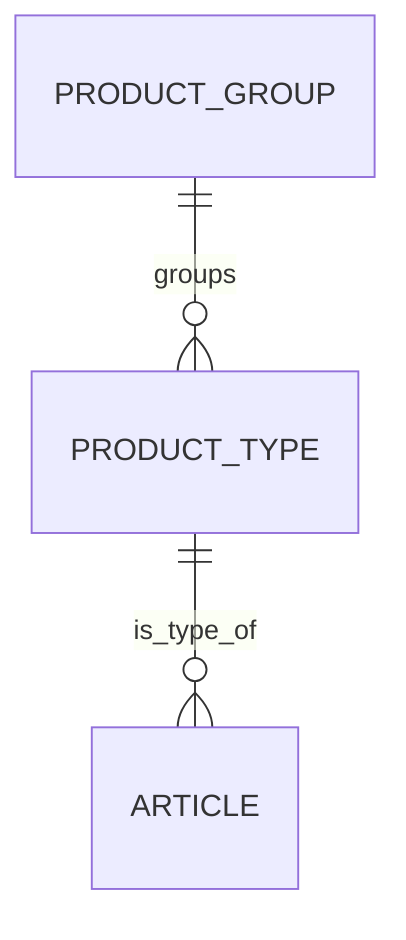
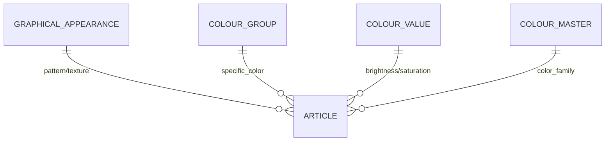
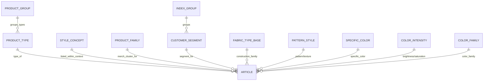

Here is the updated version of your Data Summary with the new Postgres names applied consistently to all field mentions and code examples. [ppl-ai-file-upload.s3.amazonaws](https://ppl-ai-file-upload.s3.amazonaws.com/web/direct-files/attachments/45353508/3ca46fc4-8e9a-409a-9c22-93e5e138e9cb/Data-summaryV2.md)

---

# 🧪 Dataset Specification (Compact): The Fashion Trend Alchemist

This document explains the **key data dimensions** in the H&M Personalized Fashion Recommendations dataset and how they relate to each other in the context of an **inverse design** pipeline and **RPT-1-based success prediction**. [ppl-ai-file-upload.s3.amazonaws](https://ppl-ai-file-upload.s3.amazonaws.com/web/direct-files/attachments/45353508/3ca46fc4-8e9a-409a-9c22-93e5e138e9cb/Data-summaryV2.md)

The dataset is best understood as several **orthogonal axes** (not one single product hierarchy). [ppl-ai-file-upload.s3.amazonaws](https://ppl-ai-file-upload.s3.amazonaws.com/web/direct-files/attachments/45353508/3ca46fc4-8e9a-409a-9c22-93e5e138e9cb/Data-summaryV2.md)

---

## 1) Core Item Identity & Text

| Field             | Meaning                                                    | How you use it                                                                                       |
| ----------------- | ---------------------------------------------------------- | ---------------------------------------------------------------------------------------------------- | --------------------------------------------------------------------------------------------------------------------------------------------------------------------------- |
| **`article_id`**  | Unique identifier of an article variant (the atomic item). | Join anchor across all tables; image linkage for multimodal enrichment; unit of scoring.             |
| **`prod_name`**   | Short commercial name.                                     | UI label; lightweight text signal (optional for RPT-1).                                              |
| **`detail_desc`** | Longer description text.                                   | Text appearance signal; optional LLM extraction of attributes (supporting signal, not ground truth). | [ppl-ai-file-upload.s3.amazonaws](https://ppl-ai-file-upload.s3.amazonaws.com/web/direct-files/attachments/45353508/3ca46fc4-8e9a-409a-9c22-93e5e138e9cb/Data-summaryV2.md) |

---

## 2) Key Dimensions (What / Where / For whom / How made / How it looks)

### A) Product taxonomy (WHAT it is) — **intrinsic**

- **`product_group`** (was `product_group_name`) = coarse family (e.g., `Garment Upper body`, `Shoes`, `Bags`, `Accessories`). [ppl-ai-file-upload.s3.amazonaws](https://ppl-ai-file-upload.s3.amazonaws.com/web/direct-files/attachments/45353508/3ca46fc4-8e9a-409a-9c22-93e5e138e9cb/Data-summaryV2.md)
- **`product_type`** (was `product_type_name`) = specific type/silhouette (e.g., `Dress`, `Hoodie`, `Boots`, `Backpack`). [ppl-ai-file-upload.s3.amazonaws](https://ppl-ai-file-upload.s3.amazonaws.com/web/direct-files/attachments/45353508/3ca46fc4-8e9a-409a-9c22-93e5e138e9cb/Data-summaryV2.md)

**Compact examples (minimal mapping):** [ppl-ai-file-upload.s3.amazonaws](https://ppl-ai-file-upload.s3.amazonaws.com/web/direct-files/attachments/45353508/3ca46fc4-8e9a-409a-9c22-93e5e138e9cb/Data-summaryV2.md)

- `Garment Full body` → `Dress`, `Jumpsuit/Playsuit`, `Dungarees`
- `Garment Upper body` → `Hoodie`, `Blazer`, `Blouse`, `Sweater`, `T-shirt`
- `Shoes` → `Boots`, `Sneakers`, `Sandals`, `Pumps`
- `Bags` → `Backpack`, `Cross-body bag`, `Tote bag`, `Wallet`

**Interpretation:** This is the cleanest “what is it?” axis and should be the **primary selection** for “what to generate”. [ppl-ai-file-upload.s3.amazonaws](https://ppl-ai-file-upload.s3.amazonaws.com/web/direct-files/attachments/45353508/3ca46fc4-8e9a-409a-9c22-93e5e138e9cb/Data-summaryV2.md)

---

### B) Assortment / navigation context (WHERE it is merchandised) — **curated placement**

- **`style_concept`** (was `section_name`) = “world/line/shop context” (examples from your list: `Contemporary Smart`, `Womens Trend`, `Kids Boy`, `Baby Girl`, `Collaborations`). [ppl-ai-file-upload.s3.amazonaws](https://ppl-ai-file-upload.s3.amazonaws.com/web/direct-files/attachments/45353508/3ca46fc4-8e9a-409a-9c22-93e5e138e9cb/Data-summaryV2.md)
- **`product_family`** (was `department_name`) = finer merchandising cluster used inside/alongside style concepts (examples: `Knitwear`, `Trouser`, `Shirt`, `Jersey Fancy`, `Woven Premium`, `Kids Boy Denim`). [ppl-ai-file-upload.s3.amazonaws](https://ppl-ai-file-upload.s3.amazonaws.com/web/direct-files/attachments/45353508/3ca46fc4-8e9a-409a-9c22-93e5e138e9cb/Data-summaryV2.md)

**Empirical overview (compact, from your mapping tables):** [ppl-ai-file-upload.s3.amazonaws](https://ppl-ai-file-upload.s3.amazonaws.com/web/direct-files/attachments/45353508/3ca46fc4-8e9a-409a-9c22-93e5e138e9cb/Data-summaryV2.md)

- 56 style concepts (`style_concept`), 248 product families (`product_family`), 547 observed style_concept–product_family pairs.
- Product-family to style-concept is mostly single-assigned, but not strictly:
  - 225/248 product families appear in exactly 1 style concept.
  - 23/248 product families appear in >1 style concept (reuse).

Most reused product families: `Knitwear` (11 style concepts), `Trouser` (7), `Jersey` & `Shorts` (5), `Accessories`/`Shirt`/`Jersey Fancy` (4), `Dress` (3). [ppl-ai-file-upload.s3.amazonaws](https://ppl-ai-file-upload.s3.amazonaws.com/web/direct-files/attachments/45353508/3ca46fc4-8e9a-409a-9c22-93e5e138e9cb/Data-summaryV2.md)

**Specific pattern (your Contemporary example):** [ppl-ai-file-upload.s3.amazonaws](https://ppl-ai-file-upload.s3.amazonaws.com/web/direct-files/attachments/45353508/3ca46fc4-8e9a-409a-9c22-93e5e138e9cb/Data-summaryV2.md)

- Product families like `Jersey Fancy`, `Knitwear`, `Shirt`, `Shorts`, `Trouser` appear across `Contemporary Casual` / `Contemporary Smart` / `Contemporary Street`.
- Practical meaning: `style_concept` = **style world**, `product_family` = **reusable merchandising cluster**.

**Interpretation:** Useful as **context** (placement/assortment lens), not as product-intrinsic taxonomy. [ppl-ai-file-upload.s3.amazonaws](https://ppl-ai-file-upload.s3.amazonaws.com/web/direct-files/attachments/45353508/3ca46fc4-8e9a-409a-9c22-93e5e138e9cb/Data-summaryV2.md)

---

### C) Segment positioning (FOR WHOM) — **grouping for comparability**

- **`index_group_name`** = high-level segment group: Baby/Children, Divided, Ladieswear, Menswear, Sport. [ppl-ai-file-upload.s3.amazonaws](https://ppl-ai-file-upload.s3.amazonaws.com/web/direct-files/attachments/45353508/3ca46fc4-8e9a-409a-9c22-93e5e138e9cb/Data-summaryV2.md)
- **`customer_segment`** (was `index_name`) = segment bucket that maps into exactly one index group (as per your mapping). [ppl-ai-file-upload.s3.amazonaws](https://ppl-ai-file-upload.s3.amazonaws.com/web/direct-files/attachments/45353508/3ca46fc4-8e9a-409a-9c22-93e5e138e9cb/Data-summaryV2.md)

**Index group → total articles:** [ppl-ai-file-upload.s3.amazonaws](https://ppl-ai-file-upload.s3.amazonaws.com/web/direct-files/attachments/45353508/3ca46fc4-8e9a-409a-9c22-93e5e138e9cb/Data-summaryV2.md)

- Baby/Children: 34,711
- Divided: 15,149
- Ladieswear: 39,737
- Menswear: 12,553
- Sport: 3,392
- Total: 105,542

**Customer segments (`customer_segment`) per index group (examples with counts):** [ppl-ai-file-upload.s3.amazonaws](https://ppl-ai-file-upload.s3.amazonaws.com/web/direct-files/attachments/45353508/3ca46fc4-8e9a-409a-9c22-93e5e138e9cb/Data-summaryV2.md)

- **Baby/Children**: `Baby Sizes 50-98` (8,875), `Children Sizes 92-140` (12,007), `Children Sizes 134-170` (9,214), `Children Accessories, Swimwear` (4,615).
- **Divided**: `Divided` (15,149).
- **Ladieswear**: `Ladieswear` (26,001), `Ladies Accessories` (6,961), `Lingeries/Tights` (6,775).
- **Menswear**: `Menswear` (12,553).
- **Sport**: `Sport` (3,392).

**Interpretation:** `customer_segment` is a strong candidate for **stratifying cohorts** (top/bottom should often be within the same segment). [ppl-ai-file-upload.s3.amazonaws](https://ppl-ai-file-upload.s3.amazonaws.com/web/direct-files/attachments/45353508/3ca46fc4-8e9a-409a-9c22-93e5e138e9cb/Data-summaryV2.md)

---

### D) Construction similarity (HOW it is made) — **variance reducer**

- **`fabric_type_base`** (was `garment_group_name`) groups by construction/material family (dataset-dependent labels; often knit/jersey/woven-like clusters). [ppl-ai-file-upload.s3.amazonaws](https://ppl-ai-file-upload.s3.amazonaws.com/web/direct-files/attachments/45353508/3ca46fc4-8e9a-409a-9c22-93e5e138e9cb/Data-summaryV2.md)

**Interpretation:** Helpful to reduce variance inside a `product_type` cohort (e.g., “Dress” in knit vs woven). [ppl-ai-file-upload.s3.amazonaws](https://ppl-ai-file-upload.s3.amazonaws.com/web/direct-files/attachments/45353508/3ca46fc4-8e9a-409a-9c22-93e5e138e9cb/Data-summaryV2.md)

---

## 3) Visual & Appearance Inputs (HOW it looks) — **core “DNA” features**

These are the strongest structured predictors and the primary **design** knobs for inverse design. [ppl-ai-file-upload.s3.amazonaws](https://ppl-ai-file-upload.s3.amazonaws.com/web/direct-files/attachments/45353508/3ca46fc4-8e9a-409a-9c22-93e5e138e9cb/Data-summaryV2.md)

| Field                 | Meaning                          | Examples                                                      |
| --------------------- | -------------------------------- | ------------------------------------------------------------- | --------------------------------------------------------------------------------------------------------------------------------------------------------------------------- |
| **`pattern_style`**   | Pattern/texture                  | `Solid`, `Check`, `All over pattern`, `Denim`, `Mesh`         |
| **`specific_color`**  | Specific color label             | `Dark Blue`, `Light Pink`, `Turquoise`                        |
| **`color_intensity`** | Brightness/saturation impression | `Dark`, `Dusty`, `Bright`, `Light`                            |
| **`color_family`**    | Color family                     | `Blue`, `Pink`, `Red`, `Beige`                                |
| **`detail_desc`**     | Textual appearance hints (noisy) | e.g., “V-neck”, “ribbed knit”, “wrap dress” (LLM-extractable) | [ppl-ai-file-upload.s3.amazonaws](https://ppl-ai-file-upload.s3.amazonaws.com/web/direct-files/attachments/45353508/3ca46fc4-8e9a-409a-9c22-93e5e138e9cb/Data-summaryV2.md) |

**Note:** Treat `detail_desc` as **supporting signal**; prefer structured + image-derived attributes for “grounding”. [ppl-ai-file-upload.s3.amazonaws](https://ppl-ai-file-upload.s3.amazonaws.com/web/direct-files/attachments/45353508/3ca46fc4-8e9a-409a-9c22-93e5e138e9cb/Data-summaryV2.md)

(Conceptually now: `pattern_style`, `specific_color`, `color_intensity`, `color_family`.) [ppl-ai-file-upload.s3.amazonaws](https://ppl-ai-file-upload.s3.amazonaws.com/web/direct-files/attachments/45353508/3ca46fc4-8e9a-409a-9c22-93e5e138e9cb/Data-summaryV2.md)

---

## 4) LLM Enrichment Attributes (additional design knobs)

For inverse design, a multimodal LLM extracts structured attributes from images (stored as structured columns + optional narrative). [ppl-ai-file-upload.s3.amazonaws](https://ppl-ai-file-upload.s3.amazonaws.com/web/direct-files/attachments/45353508/3ca46fc4-8e9a-409a-9c22-93e5e138e9cb/Data-summaryV2.md)

Example for `product_type = 'Dress'` (minimal): [ppl-ai-file-upload.s3.amazonaws](https://ppl-ai-file-upload.s3.amazonaws.com/web/direct-files/attachments/45353508/3ca46fc4-8e9a-409a-9c22-93e5e138e9cb/Data-summaryV2.md)

- Style (`A-line`, `Wrap`, `Shirt dress`)
- Length (`Mini`, `Midi`, `Maxi`)
- Fit (`Slim`, `Regular`, `Oversized`)
- Neckline (`V-neck`, `Round`, `Square`)
- Details (`Buttons`, `Belted`, `Ruffles`)
- Material look (`Satin`, `Jersey`, `Denim`, `Lace`)

---

## 5) Targets (WHAT you optimize)

- **`sales_volume`**: units sold (aggregated per `article_id`). [ppl-ai-file-upload.s3.amazonaws](https://ppl-ai-file-upload.s3.amazonaws.com/web/direct-files/attachments/45353508/3ca46fc4-8e9a-409a-9c22-93e5e138e9cb/Data-summaryV2.md)
- **`virality_score`**: normalized success within a cohort; name stays the same in Postgres. [ppl-ai-file-upload.s3.amazonaws](https://ppl-ai-file-upload.s3.amazonaws.com/web/direct-files/attachments/45353508/3ca46fc4-8e9a-409a-9c22-93e5e138e9cb/Data-summaryV2.md)

**Recommended cohort for normalization:** `(product_type, customer_segment)`. [ppl-ai-file-upload.s3.amazonaws](https://ppl-ai-file-upload.s3.amazonaws.com/web/direct-files/attachments/45353508/3ca46fc4-8e9a-409a-9c22-93e5e138e9cb/Data-summaryV2.md)

Optionally refine with `product_family` if the user explicitly sets a merchandising context. [ppl-ai-file-upload.s3.amazonaws](https://ppl-ai-file-upload.s3.amazonaws.com/web/direct-files/attachments/45353508/3ca46fc4-8e9a-409a-9c22-93e5e138e9cb/Data-summaryV2.md)

---

## 6) One Combined Relationship Overview (All Key Data Types)

This diagram intentionally separates: [ppl-ai-file-upload.s3.amazonaws](https://ppl-ai-file-upload.s3.amazonaws.com/web/direct-files/attachments/45353508/3ca46fc4-8e9a-409a-9c22-93e5e138e9cb/Data-summaryV2.md)

- intrinsic taxonomy (WHAT),
- contextual placement (WHERE),
- segment (FOR WHOM),
- construction similarity (HOW made),
- visual/text appearance (HOW it looks).

(Uppercase boxes correspond to the new Postgres column names.) [ppl-ai-file-upload.s3.amazonaws](https://ppl-ai-file-upload.s3.amazonaws.com/web/direct-files/attachments/45353508/3ca46fc4-8e9a-409a-9c22-93e5e138e9cb/Data-summaryV2.md)

---

## 7) Practical implication for your program (selection + RPT-1 context)

- **Primary selection (“what to generate”)**: `product_type` (optionally grouped by `product_group`). [ppl-ai-file-upload.s3.amazonaws](https://ppl-ai-file-upload.s3.amazonaws.com/web/direct-files/attachments/45353508/3ca46fc4-8e9a-409a-9c22-93e5e138e9cb/Data-summaryV2.md)
- **Optional narrowing (“in which style/assortment context”)**: `style_concept` and/or `product_family`. [ppl-ai-file-upload.s3.amazonaws](https://ppl-ai-file-upload.s3.amazonaws.com/web/direct-files/attachments/45353508/3ca46fc4-8e9a-409a-9c22-93e5e138e9cb/Data-summaryV2.md)
- **Recommended scoring strategy**: [ppl-ai-file-upload.s3.amazonaws](https://ppl-ai-file-upload.s3.amazonaws.com/web/direct-files/attachments/45353508/3ca46fc4-8e9a-409a-9c22-93e5e138e9cb/Data-summaryV2.md)
  - Intrinsic score: taxonomy + visual DNA + LLM enrichment (no style_concept/product_family/customer_segment).
  - Contextual score: adds `style_concept` / `product_family` / `customer_segment` to predict success **within that merchandising context**.

This avoids over-learning placement effects when the goal is **design** effects. [ppl-ai-file-upload.s3.amazonaws](https://ppl-ai-file-upload.s3.amazonaws.com/web/direct-files/attachments/45353508/3ca46fc4-8e9a-409a-9c22-93e5e138e9cb/Data-summaryV2.md)

---
