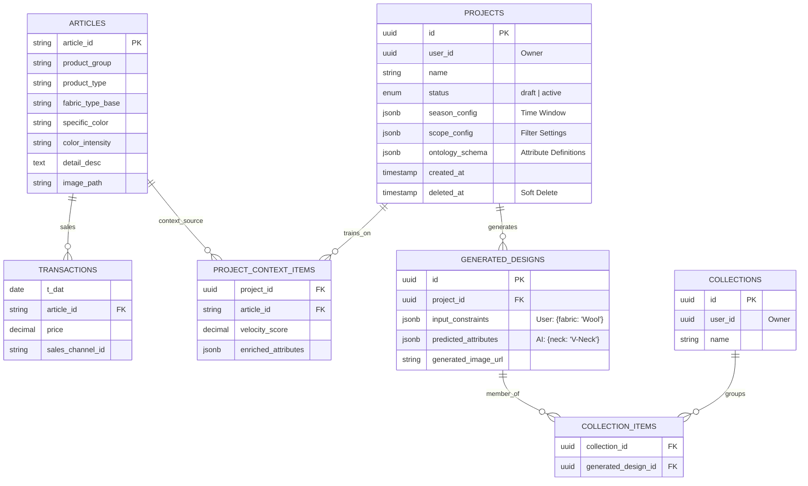

```mermaid
erDiagram
    %% 1. STATIC CATALOGUE
    ARTICLES {
        string article_id PK
        string product_group
        string product_type
        string fabric_type_base
        string specific_color
        string color_intensity
        text detail_desc
        string image_path
    }

    TRANSACTIONS {
        date t_dat
        string article_id FK
        decimal price
        string sales_channel_id
    }

    %% 2. PROJECT STATE
    PROJECTS {
        uuid id PK
        uuid user_id "Owner"
        string name
        enum status "draft | active"
        jsonb season_config "Time Window"
        jsonb scope_config "Filter Settings"
        jsonb ontology_schema "Attribute Definitions"
        timestamp created_at
        timestamp deleted_at "Soft Delete"
    }

    %% 3. CONTEXT
    PROJECT_CONTEXT_ITEMS {
        uuid project_id FK
        string article_id FK
        decimal velocity_score
        jsonb enriched_attributes
    }

    %% 4. RESULTS (The Contract vs Fulfillment)
    GENERATED_DESIGNS {
        uuid id PK
        uuid project_id FK
        jsonb input_constraints "User: {fabric: 'Wool'}"
        jsonb predicted_attributes "AI: {neck: 'V-Neck'}"
        string generated_image_url
    }

    %% 5. COLLECTIONS
    COLLECTIONS {
        uuid id PK
        uuid user_id "Owner"
        string name
    }

    COLLECTION_ITEMS {
        uuid collection_id FK
        uuid generated_design_id FK
    }

    ARTICLES ||--o{ TRANSACTIONS : sales
    ARTICLES ||--o{ PROJECT_CONTEXT_ITEMS : context_source
    PROJECTS ||--o{ PROJECT_CONTEXT_ITEMS : trains_on
    PROJECTS ||--o{ GENERATED_DESIGNS : generates
    GENERATED_DESIGNS ||--o{ COLLECTION_ITEMS : member_of
    COLLECTIONS ||--o{ COLLECTION_ITEMS : groups
```
