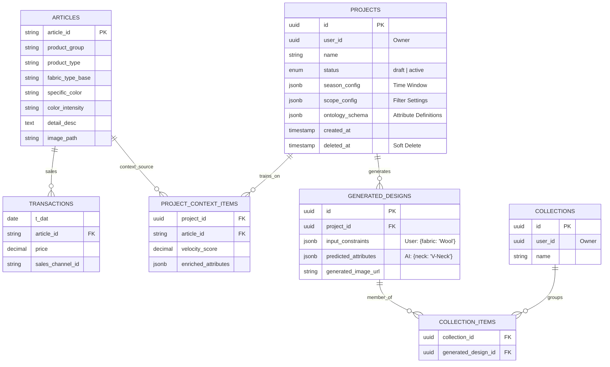

## JSONB Schema Documentation

### 1. `projects.scope_config` - Product Selection Criteria

Defines which products are included in the trend analysis.

```typescript
interface ScopeConfig {
  productTypes: string[]; // Required: Main product categories
  productGroups?: string[]; // Optional: Sub-categories within types
}
```

**Example:**

```json
{
  "productTypes": ["Swimwear", "Knitwear"],
  "productGroups": ["Bikini", "One-piece", "Pullover"]
}
```

**Usage:**

- Controls which articles are included in velocity calculations
- Frontend sends this in POST /projects
- API uses it to filter `articles` table in preview-context endpoint

---

### 2. `projects.season_config` - Time Window Configuration

Defines the time period for trend analysis based on transaction dates.

```typescript
interface SeasonConfig {
  startDate: string; // Format: "MM-DD" (e.g., "03-15")
  endDate: string; // Format: "MM-DD" (e.g., "05-31")
}
```

**Example:**

```json
{
  "startDate": "03-15",
  "endDate": "05-31"
}
```

**Usage:**

- Set when user clicks "Confirm Cohort" (lock-context endpoint)
- Controls date filtering in velocity score calculations
- Supports cross-year ranges (e.g., "12-01" to "02-28" for winter)

---

### 3. `projects.ontology_schema` - Attribute Definitions ⚠️ NOT YET IMPLEMENTED

**Status:** Placeholder for future development

Intended to store custom attribute definitions and taxonomies for the project.

```typescript
interface OntologySchema {
  attributes: Record<
    string,
    {
      type: 'categorical' | 'numerical' | 'text';
      values?: string[]; // For categorical
      range?: [number, number]; // For numerical
      required: boolean;
    }
  >;
}
```

**Planned Example:**

```json
{
  "attributes": {
    "neckline": {
      "type": "categorical",
      "values": ["Crew", "V-Neck", "Scoop", "Boat"],
      "required": true
    },
    "price_range": {
      "type": "numerical",
      "range": [10, 500],
      "required": false
    }
  }
}
```

---

### 4. `project_context_items.enriched_attributes` - Enhanced Article Data

Stores additional computed or enriched information about articles in the project context.

```typescript
interface EnrichedAttributes {
  trend_score?: number; // Computed trend momentum
  seasonality_index?: number; // How seasonal this item is
  color_dominance?: number; // Color prominence in transactions
  style_clustering?: {
    // Style group analysis
    cluster_id: string;
    similarity_score: number;
  };
  market_position?: {
    // Price positioning
    percentile: number;
    category: 'budget' | 'mid' | 'premium';
  };
}
```

**Example:**

```json
{
  "trend_score": 0.85,
  "seasonality_index": 0.3,
  "color_dominance": 0.92,
  "style_clustering": {
    "cluster_id": "summer-casual",
    "similarity_score": 0.78
  },
  "market_position": {
    "percentile": 65,
    "category": "mid"
  }
}
```

**Usage:**

- Currently set to `null` in lock-context endpoint
- Future enhancement for ML-based article enrichment
- Could be populated by separate analytics pipeline

---

### 5. `generated_designs.input_constraints` - AI Generation Input

User-specified constraints for AI design generation.

```typescript
interface InputConstraints {
  required_attributes: Record<string, string>; // Must-have attributes
  preferred_attributes?: Record<string, string>; // Nice-to-have attributes
  excluded_attributes?: Record<string, string[]>; // Forbidden values
  style_influence?: {
    reference_articles: string[]; // Article IDs for style reference
    influence_strength: number; // 0.0 - 1.0
  };
  target_market?: {
    price_range: [number, number];
    customer_segment: string;
  };
}
```

**Example:**

```json
{
  "required_attributes": {
    "fabric_type_base": "Cotton",
    "color_family": "Blue"
  },
  "preferred_attributes": {
    "style_concept": "Casual"
  },
  "excluded_attributes": {
    "pattern_style": ["Animal Print", "Graphic"]
  },
  "style_influence": {
    "reference_articles": ["art_001", "art_045"],
    "influence_strength": 0.7
  },
  "target_market": {
    "price_range": [50, 150],
    "customer_segment": "Young Adults"
  }
}
```

---

### 6. `generated_designs.predicted_attributes` - AI Generation Output

AI model's predicted attributes for the generated design.

```typescript
interface PredictedAttributes {
  generated_attributes: Record<string, string>; // AI predictions
  confidence_scores: Record<string, number>; // Prediction confidence (0.0-1.0)
  alternative_suggestions?: Record<string, string[]>; // Other viable options
  model_metadata: {
    model_version: string;
    generation_timestamp: string;
    processing_time_ms: number;
  };
}
```

**Example:**

```json
{
  "generated_attributes": {
    "product_type": "T-Shirt",
    "neckline": "V-Neck",
    "sleeve_length": "Short",
    "fit": "Regular"
  },
  "confidence_scores": {
    "product_type": 0.95,
    "neckline": 0.82,
    "sleeve_length": 0.91,
    "fit": 0.76
  },
  "alternative_suggestions": {
    "neckline": ["Crew", "Scoop"],
    "fit": ["Slim", "Loose"]
  },
  "model_metadata": {
    "model_version": "fashion-gpt-v2.1",
    "generation_timestamp": "2026-01-20T11:30:00Z",
    "processing_time_ms": 2450
  }
}
```

---

## Recent Security & Performance Updates

### ✅ SQL Injection Fix Applied (2026-01-20)

**Issue:** Season filtering used unsafe array interpolation:

```typescript
// OLD (Vulnerable):
sql`EXTRACT(MONTH FROM ${transactionsTrain.tDate}) = ANY(${months})`;

// NEW (Type-safe):
const monthConditions = months.map(
  (month) => sql`EXTRACT(MONTH FROM ${transactionsTrain.tDate}) = ${month}`
);
whereClauses.push(sql`(${sql.join(monthConditions, sql` OR `)})`);
```

**Impact:** Eliminates potential SQL injection vector in season-based filtering.

### 🔧 Drizzle ORM Architecture Standardized

**Changes Made:**

- Unified `drizzle-orm` version to `0.29.5` across monorepo
- Removed direct drizzle-orm dependency from `apps/api-lite`
- Added re-exports through `@fashion/db` package
- Implemented pnpm overrides to prevent version conflicts

**Result:** Clean TypeScript compilation and consistent query behavior.

### ⚠️ Known Technical Debt (Demo-Appropriate)

1. **Hardcoded User Authentication:** `userId` defaults to `'00000000-0000-0000-0000-000000000000'`
2. **Race Condition Risk:** Lock-context endpoint checks project status outside transaction
3. **Missing Indexes:** No database indexes defined for JSONB or foreign key columns
4. **No JSONB Validation:** Database accepts any JSON structure without schema validation

These items are **documented as acceptable** for current RPT-1 demo phase but should be addressed before production deployment.
