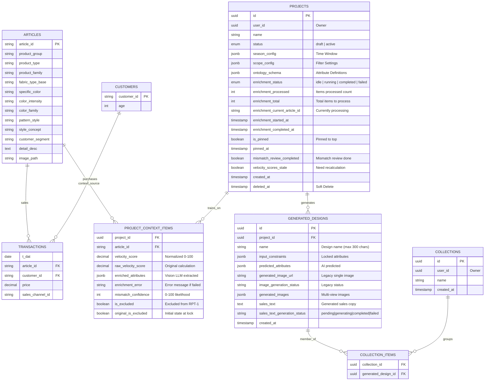

---

## JSONB Schema Documentation

### 1. `projects.scope_config` - Product Selection Criteria

Defines which products are included in the trend analysis.

```typescript
interface ScopeConfig {
  productTypes: string[]; // Required: Main product categories (e.g., ["Hoodie", "T-Shirt"])
  productGroups?: string[]; // Optional: Sub-categories within types
  productFamily?: string[];
  patternStyle?: string[];
  colorFamily?: string[];
  colorIntensity?: string[];
  specificColor?: string[];
  customerSegment?: string[];
  styleConcept?: string[];
  fabricTypeBase?: string[];
}
```

**Example:**

```json
{
  "productTypes": ["Hoodie", "Coat"],
  "colorFamily": ["Blue", "Black"],
  "customerSegment": ["Menswear"]
}
```

**Usage:**

- Controls which articles are included in velocity calculations
- Frontend sends this in POST /projects
- API uses it to filter `articles` table in preview-context endpoint

---

### 2. `projects.season_config` - Time Window Configuration

Defines the time period for trend analysis based on transaction dates.

```typescript
interface SeasonConfig {
  startDate: string; // Format: "MM-DD" (e.g., "03-15")
  endDate: string; // Format: "MM-DD" (e.g., "05-31")
}
```

**Example:**

```json
{
  "startDate": "03-15",
  "endDate": "05-31"
}
```

**Usage:**

- Set when user clicks "Confirm Cohort" (lock-context endpoint)
- Controls date filtering in velocity score calculations
- Supports cross-year ranges (e.g., "12-01" to "02-28" for winter)
- **If null/empty**: All data across all years is analyzed (no date filtering)

---

### 3. `projects.ontology_schema` - Attribute Definitions

Stores LLM-generated attribute definitions for the project's product types. Used for Vision LLM enrichment and RPT-1 predictions.

```typescript
// Structure: { productType: { attributeName: [variants] } }
type OntologySchema = Record<string, Record<string, string[]>>;
```

**Example (for hoodies and coats):**

```json
{
  "hoodie": {
    "style": ["Pullover", "Zip-up", "Half-zip"],
    "pocket_type": ["Kangaroo", "Side pockets", "No pocket"],
    "neckline": ["Round", "V-neck", "Funnel"],
    "hem_style": ["Ribbed", "Straight", "Drawstring"]
  },
  "coat": {
    "style": ["Single-breasted", "Double-breasted", "Wrap"],
    "collar": ["Notched", "Peak", "Shawl", "Stand"],
    "length": ["Short", "Mid-length", "Knee-length", "Long"]
  }
}
```

**Usage:**

- Generated via LLM when user clicks "Generate Attributes" in the Attribute Generation Dialog
- Saved when user confirms cohort (lock-context endpoint)
- Used by Vision LLM enrichment to extract attributes from product images
- Defines the AI Variables available in The Alchemist tab for RPT-1 predictions
- **Keys become attribute prefixes**: e.g., `ontology_hoodie_style`, `ontology_coat_collar`

---

### 4. `project_context_items.enriched_attributes` - Vision LLM Extracted Attributes

Stores attributes extracted from product images by the Vision LLM based on the project's ontology schema.

```typescript
// Structure matches ontology schema attributes (without prefixes)
type EnrichedAttributes = Record<string, string>;
```

**Example (for a hoodie article):**

```json
{
  "style": "Pullover",
  "pocket_type": "Kangaroo",
  "neckline": "Round",
  "hem_style": "Ribbed"
}
```

**Usage:**

- Populated by Vision LLM enrichment process (POST /api/projects/:id/start-enrichment)
- Each attribute key corresponds to an attribute in the project's ontology schema
- Values are selected from the predefined variants in the ontology
- Used as training data for RPT-1 predictions
- Displayed in the Enhanced Table tab with dynamic columns

**Note:** If enrichment fails for an item, `enriched_attributes` remains `null` and the error message is stored in `enrichment_error`.

---

### 5. `generated_designs.input_constraints` - Locked Attributes

User-specified locked attributes for AI design generation. These are the values the user explicitly set (not AI-predicted).

```typescript
// Simple key-value structure with attribute keys and their locked values
type InputConstraints = Record<string, string>;
```

**Example:**

```json
{
  "article_color_family": "Blue",
  "article_fabric_type_base": "Cotton",
  "ontology_hoodie_style": "Pullover"
}
```

**Key Naming Convention:**

- `article_*` - Article-level attributes from the database
- `ontology_{productType}_*` - Ontology-generated attributes

---

### 6. `generated_designs.predicted_attributes` - AI Predicted Attributes

AI model's predicted attributes for the generated design from RPT-1.

```typescript
// Simple key-value structure with attribute keys and their predicted values
type PredictedAttributes = Record<string, string>;
```

**Example:**

```json
{
  "ontology_hoodie_pocket_type": "Kangaroo",
  "ontology_hoodie_neckline": "Round",
  "ontology_hoodie_hem_style": "Ribbed"
}
```

---

### 7. `generated_designs.generated_images` - Multi-View Image Storage

Stores URLs and generation status for multiple image views (front, back, model).

```typescript
interface GeneratedImages {
  front: {
    url: string | null; // S3/SeaweedFS URL when completed
    status: 'pending' | 'generating' | 'completed' | 'failed';
  };
  back: {
    url: string | null;
    status: 'pending' | 'generating' | 'completed' | 'failed';
  };
  model: {
    url: string | null;
    status: 'pending' | 'generating' | 'completed' | 'failed';
  };
}
```

**Example:**

```json
{
  "front": {
    "url": "https://s3.example.com/designs/abc123-front.png",
    "status": "completed"
  },
  "back": {
    "url": "https://s3.example.com/designs/abc123-back.png",
    "status": "completed"
  },
  "model": {
    "url": null,
    "status": "generating"
  }
}
```

**Usage:**

- Images are generated sequentially (front → back → model)
- Frontend polls `/api/projects/:projectId/generated-designs/:designId/image-status` for updates
- The overall `image_generation_status` field reflects combined status:
  - `pending` - No images started
  - `generating` - At least one image in progress
  - `completed` - All 3 images successful
  - `partial` - Some images completed, some failed
  - `failed` - All images failed

---

## Data Flows

### 1. Vision LLM Enrichment Flow

The enrichment process extracts structured attributes from product images using a Vision LLM.

#### Enrichment States

Projects track enrichment progress with these states:

- **idle**: Not started or completed
- **running**: Currently processing items
- **completed**: All items processed successfully
- **failed**: Stopped due to fatal error

#### Mismatch Detection

During enrichment, the Vision LLM also evaluates product type accuracy:

| Confidence Range | Label              | Action              |
| ---------------- | ------------------ | ------------------- |
| 0-59             | Likely match       | No flag             |
| 60-79            | Possible mismatch  | Optional review     |
| 80-89            | Likely mismatch    | Flagged for review  |
| 90-100           | Very likely mismatch | Flagged for review |

Items with `mismatch_confidence >= 80` trigger the mismatch review workflow in the UI.

#### API Endpoints

| Endpoint                               | Method | Description                                      |
| -------------------------------------- | ------ | ------------------------------------------------ |
| `/api/projects/:id/start-enrichment`   | POST   | Start enrichment for all unenriched items        |
| `/api/projects/:id/enrichment-progress`| GET    | SSE endpoint for real-time progress updates      |
| `/api/projects/:id/enrichment-status`  | GET    | Get current enrichment state (for page reload)   |
| `/api/projects/:id/retry-enrichment`   | POST   | Retry failed items                               |
| `/api/projects/:id/context-items`      | GET    | Get all context items with enrichment status     |

#### Processing Logic

1. Items are processed where `enriched_attributes IS NULL AND enrichment_error IS NULL`
2. Each item: fetch image → call Vision LLM → parse JSON response → store attributes + mismatch confidence
3. Failed items get `enrichment_error` set (truncated to 1000 chars)
4. Retry clears `enrichment_error` to `null`, making items eligible for reprocessing
5. Progress tracked via SSE with `processed`, `total`, and `currentArticleId`

---

### 2. RPT-1 Design Generation Flow

The RPT-1 (Reverse Product Transmutation) flow generates new design predictions and images.

#### Attribute Categories in TheAlchemistTab

| Category     | Purpose                                    | Sent to API As       |
| ------------ | ------------------------------------------ | -------------------- |
| Locked       | User-defined constraints                   | `lockedAttributes`   |
| AI Variables | Attributes for AI to predict (max 10)      | `aiVariables`        |
| Not Included | Excluded from prediction context           | -                    |
| Auto-Excluded| Single-variant attributes (hidden from UI) | `contextAttributes`  |

#### API Request Structure

```typescript
interface RPT1PredictRequest {
  lockedAttributes: Record<string, string>; // User-locked values
  aiVariables: string[];                     // Keys for AI to predict
  successScore: number;                      // Target performance (0-100)
  contextAttributes?: Record<string, string>; // Auto-excluded single-variant attributes
}
```

#### Image Prompt Generation

Before generating images, the system uses LLM-based prompt generation:

1. **Preprocessing**: Merges `lockedAttributes`, `predictedAttributes`, and `contextAttributes`
2. **Product Detection**: Extracts product type from `article_product_type` or ontology keys
3. **Category Mapping**: Maps to Upper Body, Lower Body, Full Body, Footwear, or Accessory
4. **LLM Generation**: Calls GPT-4.1 with detailed rules for:
   - Front view (ghost mannequin or flat lay depending on category)
   - Back view (excludes front-only features)
   - Model view (determines gender, adds complementary garments)
5. **Fallback**: If LLM fails twice, uses static templates

#### Image Generation

After prompts are generated, images are created sequentially via SAP AI Core / Z-Image Turbo:

1. Generate front image with view-specific prompt
2. Generate back image with view-specific prompt
3. Generate model image with view-specific prompt
4. Each image is uploaded to S3/SeaweedFS
5. Status updates stored in `generated_images` JSONB column

---

### 3. Velocity Score Calculation

The velocity score measures sales performance normalized across products.

#### Formula

```
Velocity = Transaction Count / Days Available
```

- Days Available = `(last_transaction_date - first_transaction_date + 1)`
- Measures how quickly items sell relative to their availability period

#### Normalization

At lock time, raw velocity scores are normalized to 0-100:

```
normalized = (score - min) / (max - min) * 100
```

- Lowest performer in context = 0
- Highest performer = 100
- Stored in `project_context_items.velocity_score`
- Original calculation preserved in `raw_velocity_score`

#### Recalculation

When articles are excluded, velocity scores can become stale:

1. `is_excluded = true` is set on excluded articles
2. `velocity_scores_stale = true` is set on the project
3. User triggers recalculation via "Recalculate" button
4. Normalization re-runs among included articles only
5. `velocity_scores_stale = false` after completion

---

## Recent Security & Performance Updates

### SQL Injection Fix Applied (2026-01-20)

**Issue:** Season filtering used unsafe array interpolation:

```typescript
// OLD (Vulnerable):
sql`EXTRACT(MONTH FROM ${transactionsTrain.tDate}) = ANY(${months})`;

// NEW (Type-safe):
const monthConditions = months.map(
  (month) => sql`EXTRACT(MONTH FROM ${transactionsTrain.tDate}) = ${month}`
);
whereClauses.push(sql`(${sql.join(monthConditions, sql` OR `)})`);
```

**Impact:** Eliminates potential SQL injection vector in season-based filtering.

### Drizzle ORM Architecture Standardized

**Changes Made:**

- Unified `drizzle-orm` version to `0.29.5` across monorepo
- Removed direct drizzle-orm dependency from `apps/api-lite`
- Added re-exports through `@fashion/db` package
- Implemented pnpm overrides to prevent version conflicts

**Result:** Clean TypeScript compilation and consistent query behavior.

---

## Known Technical Debt (Demo-Appropriate)

1. **Hardcoded User Authentication:** `userId` defaults to `'00000000-0000-0000-0000-000000000000'`
2. **Race Condition Risk:** Lock-context endpoint checks project status outside transaction
3. **Missing Indexes:** No database indexes defined for JSONB or foreign key columns
4. **No JSONB Validation:** Database accepts any JSON structure without schema validation
5. **Image Storage Dependency:** Images served via SeaweedFS Filer; requires port-forwarding for local dev
6. **Mock Collections:** Collections feature uses mock data (see docs/CollectionMock.md)

These items are **documented as acceptable** for current demo phase but should be addressed before production deployment.

---

## Database Indexes

### Primary Tables

| Table                    | Index                       | Columns               |
| ------------------------ | --------------------------- | --------------------- |
| transactions_train       | idx_transactions_article_id | article_id            |
| transactions_train       | idx_transactions_t_date     | t_date                |
| transactions_train       | idx_transactions_customer_id| customer_id           |
| project_context_items    | (composite PK)              | project_id, article_id|

### Recommended Additional Indexes (Not Implemented)

- `projects.user_id` - For user-scoped queries
- `projects.is_pinned, pinned_at` - For pin sorting
- `generated_designs.project_id` - For design listing
- `collection_items.collection_id` - For collection queries

---

## API Endpoint Reference

### Core Endpoints

| Endpoint                                          | Method | Description                              |
| ------------------------------------------------- | ------ | ---------------------------------------- |
| `/health`                                         | GET    | Health check                             |
| `/api/taxonomy`                                   | GET    | Product type hierarchy                   |
| `/api/transactions/count`                         | GET    | Count filtered transactions              |
| `/api/articles/count`                             | GET    | Count distinct articles by product type  |
| `/api/filters/attributes`                         | GET    | Dynamic filter options                   |
| `/api/products`                                   | GET    | Paginated product listing                |
| `/api/generate-attributes`                        | POST   | LLM-based ontology generation            |
| `/api/generate-design-name`                       | POST   | LLM-based design name generation         |

### Project Endpoints

| Endpoint                                                      | Method | Description                              |
| ------------------------------------------------------------- | ------ | ---------------------------------------- |
| `/api/projects`                                               | GET    | List all projects                        |
| `/api/projects`                                               | POST   | Create new project                       |
| `/api/projects/:id`                                           | GET    | Get single project                       |
| `/api/projects/:id`                                           | DELETE | Delete project and images                |
| `/api/projects/:id/preview-context`                           | GET    | Calculate velocity scores preview        |
| `/api/projects/:id/lock-context`                              | POST   | Lock project context                     |
| `/api/projects/:id/pin`                                       | PATCH  | Toggle pin status (max 3)                |
| `/api/projects/:id/mismatch-review`                           | PATCH  | Bulk update exclusions                   |
| `/api/projects/:id/context-items/:articleId/exclude`          | PATCH  | Toggle single exclusion                  |
| `/api/projects/:id/recalculate-velocity`                      | POST   | Re-normalize velocity scores             |
| `/api/projects/:id/generated-designs`                         | GET    | List designs for project                 |
| `/api/projects/:projectId/generated-designs/:designId`        | DELETE | Delete specific design                   |
| `/api/projects/:projectId/generated-designs/:designId`        | PATCH  | Update design (rename)                   |
| `/api/projects/:projectId/generated-designs/:designId/image-status` | GET | Get multi-image generation status   |

### Enrichment Endpoints

| Endpoint                                          | Method | Description                              |
| ------------------------------------------------- | ------ | ---------------------------------------- |
| `/api/projects/:id/start-enrichment`              | POST   | Start enrichment                         |
| `/api/projects/:id/enrichment-progress`           | GET    | SSE progress updates                     |
| `/api/projects/:id/enrichment-status`             | GET    | Current enrichment state                 |
| `/api/projects/:id/retry-enrichment`              | POST   | Retry failed items                       |
| `/api/projects/:id/context-items`                 | GET    | Get context items with status            |

### RPT-1 Endpoints

| Endpoint                                          | Method | Description                              |
| ------------------------------------------------- | ------ | ---------------------------------------- |
| `/api/projects/:id/rpt1-preview`                  | GET    | Get context row counts                   |
| `/api/projects/:id/rpt1-predict`                  | POST   | Execute RPT-1 prediction + image gen     |

### Collection Endpoints

| Endpoint                                          | Method | Description                              |
| ------------------------------------------------- | ------ | ---------------------------------------- |
| `/api/collections`                                | GET    | List user collections (mock data)        |
