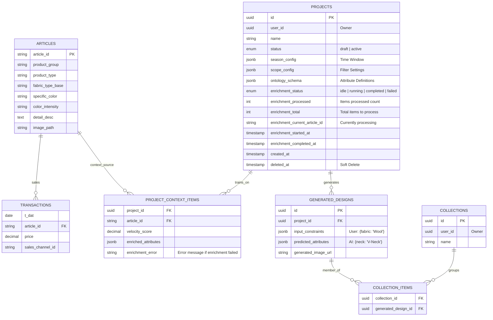

## JSONB Schema Documentation

### 1. `projects.scope_config` - Product Selection Criteria

Defines which products are included in the trend analysis.

```typescript
interface ScopeConfig {
  productTypes: string[]; // Required: Main product categories
  productGroups?: string[]; // Optional: Sub-categories within types
}
```

**Example:**

```json
{
  "productTypes": ["Swimwear", "Knitwear"],
  "productGroups": ["Bikini", "One-piece", "Pullover"]
}
```

**Usage:**

- Controls which articles are included in velocity calculations
- Frontend sends this in POST /projects
- API uses it to filter `articles` table in preview-context endpoint

---

### 2. `projects.season_config` - Time Window Configuration

Defines the time period for trend analysis based on transaction dates.

```typescript
interface SeasonConfig {
  startDate: string; // Format: "MM-DD" (e.g., "03-15")
  endDate: string; // Format: "MM-DD" (e.g., "05-31")
}
```

**Example:**

```json
{
  "startDate": "03-15",
  "endDate": "05-31"
}
```

**Usage:**

- Set when user clicks "Confirm Cohort" (lock-context endpoint)
- Controls date filtering in velocity score calculations
- Supports cross-year ranges (e.g., "12-01" to "02-28" for winter)

---

### 3. `projects.ontology_schema` - Attribute Definitions

Stores LLM-generated attribute definitions for the project's product types. Used for Vision LLM enrichment and RPT-1 predictions.

```typescript
// Structure: { productType: { attributeName: [variants] } }
type OntologySchema = Record<string, Record<string, string[]>>;
```

**Example (for skirts):**

```json
{
  "skirt": {
    "style": ["A-line", "Pencil", "Wrap", "Pleated", "Maxi"],
    "fit": ["Slim", "Regular", "Loose"],
    "length": ["Mini", "Midi", "Maxi"],
    "waist_style": ["High-waisted", "Mid-rise", "Low-rise"]
  }
}
```

**Usage:**

- Generated via LLM when user clicks "Generate Attributes" in the Attribute Generation Dialog
- Saved when user confirms cohort (lock-context endpoint)
- Used by Vision LLM enrichment to extract attributes from product images
- Defines the AI Variables available in The Alchemist tab for RPT-1 predictions
```

---

### 4. `project_context_items.enriched_attributes` - Vision LLM Extracted Attributes

Stores attributes extracted from product images by the Vision LLM based on the project's ontology schema.

```typescript
// Structure matches ontology schema attributes
type EnrichedAttributes = Record<string, string>;
```

**Example (for a skirt article):**

```json
{
  "style": "A-line",
  "fit": "Regular",
  "length": "Midi",
  "waist_style": "High-waisted"
}
```

**Usage:**

- Populated by Vision LLM enrichment process (POST /api/projects/:id/start-enrichment)
- Each attribute key corresponds to an attribute in the project's ontology schema
- Values are selected from the predefined variants in the ontology
- Used as training data for RPT-1 predictions
- Displayed in the Enhanced Table tab with dynamic columns

**Note:** If enrichment fails for an item, `enriched_attributes` remains `null` and the error message is stored in `enrichment_error`.

---

### 5. `generated_designs.input_constraints` - AI Generation Input

User-specified constraints for AI design generation.

```typescript
interface InputConstraints {
  required_attributes: Record<string, string>; // Must-have attributes
  preferred_attributes?: Record<string, string>; // Nice-to-have attributes
  excluded_attributes?: Record<string, string[]>; // Forbidden values
  style_influence?: {
    reference_articles: string[]; // Article IDs for style reference
    influence_strength: number; // 0.0 - 1.0
  };
  target_market?: {
    price_range: [number, number];
    customer_segment: string;
  };
}
```

**Example:**

```json
{
  "required_attributes": {
    "fabric_type_base": "Cotton",
    "color_family": "Blue"
  },
  "preferred_attributes": {
    "style_concept": "Casual"
  },
  "excluded_attributes": {
    "pattern_style": ["Animal Print", "Graphic"]
  },
  "style_influence": {
    "reference_articles": ["art_001", "art_045"],
    "influence_strength": 0.7
  },
  "target_market": {
    "price_range": [50, 150],
    "customer_segment": "Young Adults"
  }
}
```

---

### 6. `generated_designs.predicted_attributes` - AI Generation Output

AI model's predicted attributes for the generated design.

```typescript
interface PredictedAttributes {
  generated_attributes: Record<string, string>; // AI predictions
  confidence_scores: Record<string, number>; // Prediction confidence (0.0-1.0)
  alternative_suggestions?: Record<string, string[]>; // Other viable options
  model_metadata: {
    model_version: string;
    generation_timestamp: string;
    processing_time_ms: number;
  };
}
```

**Example:**

```json
{
  "generated_attributes": {
    "product_type": "T-Shirt",
    "neckline": "V-Neck",
    "sleeve_length": "Short",
    "fit": "Regular"
  },
  "confidence_scores": {
    "product_type": 0.95,
    "neckline": 0.82,
    "sleeve_length": 0.91,
    "fit": 0.76
  },
  "alternative_suggestions": {
    "neckline": ["Crew", "Scoop"],
    "fit": ["Slim", "Loose"]
  },
  "model_metadata": {
    "model_version": "fashion-gpt-v2.1",
    "generation_timestamp": "2026-01-20T11:30:00Z",
    "processing_time_ms": 2450
  }
}
```

---

## Recent Security & Performance Updates

### ✅ SQL Injection Fix Applied (2026-01-20)

**Issue:** Season filtering used unsafe array interpolation:

```typescript
// OLD (Vulnerable):
sql`EXTRACT(MONTH FROM ${transactionsTrain.tDate}) = ANY(${months})`;

// NEW (Type-safe):
const monthConditions = months.map(
  (month) => sql`EXTRACT(MONTH FROM ${transactionsTrain.tDate}) = ${month}`
);
whereClauses.push(sql`(${sql.join(monthConditions, sql` OR `)})`);
```

**Impact:** Eliminates potential SQL injection vector in season-based filtering.

### 🔧 Drizzle ORM Architecture Standardized

**Changes Made:**

- Unified `drizzle-orm` version to `0.29.5` across monorepo
- Removed direct drizzle-orm dependency from `apps/api-lite`
- Added re-exports through `@fashion/db` package
- Implemented pnpm overrides to prevent version conflicts

**Result:** Clean TypeScript compilation and consistent query behavior.

### ⚠️ Known Technical Debt (Demo-Appropriate)

1. **Hardcoded User Authentication:** `userId` defaults to `'00000000-0000-0000-0000-000000000000'`
2. **Race Condition Risk:** Lock-context endpoint checks project status outside transaction
3. **Missing Indexes:** No database indexes defined for JSONB or foreign key columns
4. **No JSONB Validation:** Database accepts any JSON structure without schema validation
5. **Image Storage Dependency:** Images served via SeaweedFS Filer; requires port-forwarding for local dev

These items are **documented as acceptable** for current demo phase but should be addressed before production deployment.

---

## Vision LLM Enrichment Flow

The enrichment process extracts structured attributes from product images using a Vision LLM.

### Enrichment States

Projects track enrichment progress with these states:
- **idle**: Not started or completed
- **running**: Currently processing items
- **completed**: All items processed successfully
- **failed**: Stopped due to fatal error

### API Endpoints

| Endpoint | Method | Description |
|----------|--------|-------------|
| `/api/projects/:id/start-enrichment` | POST | Start enrichment for all unenriched items |
| `/api/projects/:id/enrichment-progress` | GET | SSE endpoint for real-time progress updates |
| `/api/projects/:id/enrichment-status` | GET | Get current enrichment state (for page reload recovery) |
| `/api/projects/:id/retry-enrichment` | POST | Retry failed items (optionally specify articleIds) |
| `/api/projects/:id/context-items` | GET | Get all context items with enrichment status |

### Processing Logic

1. Items are processed where `enriched_attributes IS NULL AND enrichment_error IS NULL`
2. Each item: fetch image → call Vision LLM → parse JSON response → store attributes
3. Failed items get `enrichment_error` set (truncated to 1000 chars)
4. Retry clears `enrichment_error` to `null`, making items eligible for reprocessing
5. Progress tracked via SSE with `processed`, `total`, and `currentArticleId`
