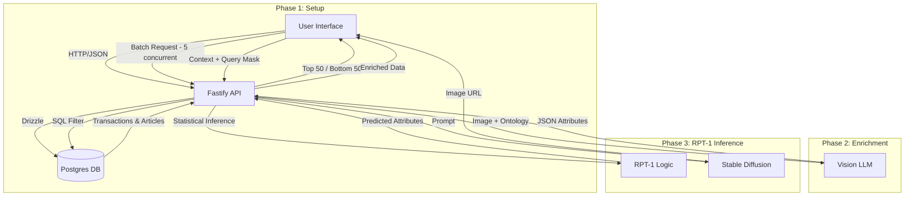

This is the **Master Product Requirements Document (PRD) v5.0**.

It merges the original business intent, the semantic data analysis, the specific screen flows, and the finalized technical architecture into a single source of truth for the engineering team.

---

# Product Requirements Document (PRD)

## Project: The Fashion Trend Alchemist

**Version:** 5.0 (Master Merged)
**Status:** Approved for Development
**Tech Stack:** React (Vite) + Node (Fastify) + Postgres (Drizzle)

---

## 1. Executive Summary

**The Fashion Trend Alchemist** is an AI-powered workstation for **Inverse Design**. Traditional analytics predict sales for _existing_ products. This system analyzes high-velocity sales data ("Context Cohort") to **mathematically generate** the design attributes (Cut, Color, Fabric, Aesthetic) of a _future_ best-seller.

**Core Value Proposition:**

1. **Dynamic Context:** Learns from a user-defined cohort (e.g., "Streetwear Coats that sold well in October").
2. **Semantic Intelligence:** Uses Multimodal LLMs to translate raw catalogue images into structured design attributes ("Ontology").
3. **One-Shot Inference:** Uses RPT-1 logic to predict missing design variables to maximize a target "Virality Score."

---

## 2. User Personas

1. **The Merchandiser (The "Scope" Owner):**

- _Goal:_ Ensure the product fills a gap in the assortment plan (e.g., "We need a Winter Jacket for the Youth segment").
- _Action:_ Defines the Product Group, Seasonality, and Target Filters.

2. **The Designer (The "Vibe" Owner):**

- _Goal:_ Create a visually compelling product that hits trend targets.
- _Action:_ Defines the Ontology, Locks specific aesthetic constraints, and visualizes the output.

---

## 3. System Architecture

The system follows a **Modern Monorepo Architecture** to ensure type safety across the full stack.

### 3.1 Technical Components

| Layer          | Technology                 | Role                                                                                                                             |
| -------------- | -------------------------- | -------------------------------------------------------------------------------------------------------------------------------- |
| **Repo**       | **pnpm Workspace**         | Monorepo structure. Shared `packages/types` folder containing **Zod** schemas for API contracts and DB models.                   |
| **Frontend**   | **React + Vite**           | SPA Framework.                                                                                                                   |
| **UI Library** | **SAP UI5 Web Components** | Provides Enterprise/SAP look-and-feel (ShellBar, ObjectPage, AnalyticalTable) without Fiori Elements rigidity.                   |
| **State**      | **TanStack Query**         | Manages async server state (Projects, Context).                                                                                  |
| **Batching**   | **p-limit / Promise.all**  | **Client-Side Concurrency Control.** The Frontend manages the queue of 100+ LLM enrichment requests to prevent Backend timeouts. |
| **Backend**    | **Node.js (Fastify)**      | API Server. Chosen for high-throughput JSON serialization.                                                                       |
| **Database**   | **PostgreSQL**             | Relational DB. Stores Projects, H&M Static Data, and Generated Designs.                                                          |
| **ORM**        | **Drizzle ORM**            | Type-safe SQL builder.                                                                                                           |
| **AI Layer**   | **External APIs**          | OpenAI/Gemini (Text/Vision), Stable Diffusion (Image Gen).                                                                       |

### 3.2 Data Flow Diagram (Mermaid)

---

## 4. Functional Requirements (Screen Workflow)

The application uses a **"One-Way Door"** workflow. Projects start in **Draft** (Setup) and move to **Active** (Design Hub). Once Active, the Scope is locked to preserve data integrity.

### Screen 1: The Launchpad

- **Type:** List Report.
- **Data:** List of Projects (`name`, `target_season`, `product_group`, `status`, `last_modified`).
- **Features:**
- **Pinning:** Boolean toggle to fix projects to top.
- **Status Indicators:** "Draft" (Grey), "Active" (Green).
- **Action:** `[Create New Project]` Navigates to Screen 2.

### Screen 2: Scope Selection (Wizard Step 1)

- **Inputs:**
- `Product Group`: Single Select (e.g., "Garment Upper Body").
- `Product Type`: Multi-Select (e.g., "Coat", "Outdoor Waistcoat").

- **Validation:**
- **Variance Warning:** If >3 distinct types selected, show: _"Warning: High variance reduces RPT-1 precision."_

### Screen 3: Context & Seasonal Filter (Wizard Step 2)

- **The Seasonal Lens:**
- **Input:** `Target Launch Month` Slider (1–12).
- **Logic:** System filters `transactions` table to `[Month-1, Month, Month+1]`.

- **Attribute Filters:**
- Dropdowns for `Customer_Segment` (e.g., Menswear) or `Style_Concept`.

- **The Cohort Table:**
- Displays **Top 50** and **Bottom 50** items based on the **Velocity Score**.
- _Columns:_ Thumb, Name, Product Family, Velocity Score, Days Active.

### Screen 4: Ontology Creator (Wizard Step 3)

- **State A: Generation**
- Button `[Generate Schema]`. Calls Text-LLM with `Product_Types`. Returns JSON Schema (Attributes + Enums).

- **State B: Refinement**
- **Feedback Loop:** Chat input ("Add details about Zippers") `[Regenerate]`.
- **Manual Edit:** Add/Delete attributes via UI.

- **State C: Finalization (The Lock)**
- Button `[Lock & Extract]`.
- **Action:** Saves Schema to DB. Sets Project Status = `Active`. Navigates to Screen 5.

### Screen 5: The Design Hub (RPT-1 Grid)

- **Component:** `ObjectPage` with Tabs.
- **State 1: Enrichment (Auto-Start)**
- On entry, Frontend checks if Context Items have `enriched_attributes`.
- If null, initiates **Client-Side Batching** (sending 5 images at a time to `/api/ai/enrich`).
- **Progress Bar:** "Analyzing Context: 42/100".

- **State 2: The Transmutation Grid (Tab 1)**
- **Left Col (Inputs):** Dynamic Form based on Ontology.
- **Lock Mode:** User selects value (e.g., Color="Green").
- **Predict Mode:** User selects `[PREDICT]` (Gold visual).

- **Right Col (Target):** `Virality Score` Input (Default: 100).
- **Action:** `[Transmute]` button.

### Screen 6: Visual Payoff (Result Modal)

- **Output:**
- **Spec Sheet:** List of predicted attributes (Highlighted in Gold).
- **Visuals:** 4 AI-Generated images (Stable Diffusion) based on "Ghost Mannequin" prompt structure.
- **Action:** `[Save to Collection]`.

---

## 5. Data Architecture (Schema & Semantics)

We use **Semantic Naming** to map H&M's technical columns to Business Design terms.

### 5.1 Postgres Tables (Drizzle Schema)

**1. `projects**`

- `id` (UUID, PK)
- `name` (String)
- `status` (Enum: 'draft', 'active')
- `scope_config` (JSONB) - Stores selected types/groups.
- `ontology_schema` (JSONB) - The finalized attribute structure.

**2. `articles` (Static Data)**

- `article_id` (String, PK)
- `product_group` (String)
- `product_type` (String)
- `product_family` (String) _[Mapped from: department_name]_
- `style_concept` (String) _[Mapped from: section_name]_
- `pattern_style` (String) _[Mapped from: graphical_appearance_name]_
- `specific_color` (String)
- `image_path` (String)

**3. `transactions` (Static Data)**

- `t_dat` (Date)
- `article_id` (FK)
- `price` (Decimal)

**4. `project_context_items` (Dynamic Link)**

- `project_id` (FK)
- `article_id` (FK)
- `velocity_score` (Decimal) - Snapshot at creation.
- `enriched_attributes` (JSONB) - Result of Vision LLM (Screen 5).

**5. `generated_designs` (Results)**

- `id` (UUID, PK)
- `project_id` (FK)
- `final_attributes` (JSONB) - The RPT-1 Output.
- `generated_image_url` (String)

---

## 6. Logic & Algorithms

### 6.1 Velocity Score (The "Success" Metric)

To normalize "Success" across different time periods:

- **Window:** `[Target Month - 1]` to `[Target Month + 1]`.
- **Normalization:** Score is relative to the Max Velocity within the selected `Product_Group` for that window.

### 6.2 The RPT-1 Logic (Inverse Inference)

RPT-1 is not a trained model, but an **Inference Engine**:

1. **Input:**

- `Context`: Array of 100 objects (50 High Score, 50 Low Score) with attributes.
- `Query`: Object with some Fixed attributes and some `null` (Masked).
- `Target`: Score = 100.

2. **Logic:**

- Calculates probability distribution of Masked Attributes appearing in High-Score items vs Low-Score items.
- Selects attribute values that maximize the likelihood of the Target Score.

---

## 7. API Specification (Fastify Routes)

### Group 1: Project Management

- `POST /api/projects`
- Create Draft. Body: `{ name, product_group }`

- `PATCH /api/projects/:id`
- Update Scope/Ontology.

- `POST /api/projects/:id/finalize`
- Locks Project. Triggers DB update `status='active'`.

### Group 2: Context Data

- `POST /api/context/cohort`
- Body: `{ product_types: [], target_month: 6, filters: {} }`
- **Logic:** Executes the Seasonal Velocity SQL query.
- Response: `{ top_50: [], bottom_50: [] }`

### Group 3: AI Services (Stateless)

- `POST /api/ai/ontology/generate`
- Input: Product Types. Output: JSON Schema.

- `POST /api/ai/enrich` **(High Volume)**
- Input: `{ image_url, ontology_schema }`
- Output: JSON Attributes.

- `POST /api/ai/predict`
- Input: `{ context_rows: [], query_mask: {}, target: 100 }`
- Output: Filled JSON.

---

## 8. Non-Functional Requirements

1. **Performance:**

- **Context Batching:** The Frontend MUST implement concurrency throttling (max 5 simultaneous requests) for the Enrichment phase to ensure the UI remains responsive and the backend is not overwhelmed.

2. **Security:**

- API Inputs must be validated using **Zod** schemas shared from the Monorepo.

3. **Responsiveness:**

- UI5 Web Components must be used to ensure the application works on Tablet/Desktop (Mobile is low priority).

---

## 9. Implementation Roadmap

1. **Setup:** Initialize `pnpm` Monorepo, Fastify, and Drizzle.
2. **Data Ingestion:** Import H&M CSVs into Postgres with Semantic Renaming.
3. **Wizard UI:** Build Screens 1-3 (Scope & Context Logic).
4. **AI Integration:** Implement Client-Side Batching & Vision LLM hook.
5. **The Alchemist:** Build Screen 5 (Grid) & RPT-1 Logic.
6. **Visualization:** Connect Stable Diffusion.
