This is the **Master Product Requirements Document (PRD) v6.0**.

It merges the original business intent, the semantic data analysis, the specific screen flows, and the finalized technical architecture into a single source of truth for the engineering team.

---

# Product Requirements Document (PRD)

## Project: The Fashion Trend Alchemist

**Version:** 6.0 (Updated February 2026)
**Status:** Phase 4 In Progress
**Tech Stack:** React (Vite) + Node (Fastify) + Postgres (Drizzle) + SAP AI Core

---

## 1. Executive Summary

**The Fashion Trend Alchemist** is an AI-powered workstation for **Inverse Design**. Traditional analytics predict sales for _existing_ products. This system analyzes high-velocity sales data ("Context Cohort") to **mathematically generate** the design attributes (Cut, Color, Fabric, Aesthetic) of a _future_ best-seller.

**Core Value Proposition:**

1. **Dynamic Context:** Learns from a user-defined cohort (e.g., "Streetwear Coats that sold well in October").
2. **Semantic Intelligence:** Uses Multimodal LLMs to translate raw catalogue images into structured design attributes ("Ontology").
3. **One-Shot Inference:** Uses RPT-1 logic to predict missing design variables to maximize a target "Virality Score."

---

## 2. User Personas

1. **The Merchandiser (The "Scope" Owner):**

- _Goal:_ Ensure the product fills a gap in the assortment plan (e.g., "We need a Winter Jacket for the Youth segment").
- _Action:_ Defines the Product Group, Seasonality, and Target Filters.

2. **The Designer (The "Vibe" Owner):**

- _Goal:_ Create a visually compelling product that hits trend targets.
- _Action:_ Defines the Ontology, Locks specific aesthetic constraints, and visualizes the output.

---

## 3. System Architecture

The system follows a **Modern Monorepo Architecture** to ensure type safety across the full stack.

### 3.1 Technical Components

| Layer          | Technology                 | Role                                                                                                                             |
| -------------- | -------------------------- | -------------------------------------------------------------------------------------------------------------------------------- |
| **Repo**       | **pnpm Workspace**         | Monorepo structure. Shared `packages/types` folder containing **Zod** schemas for API contracts and DB models.                   |
| **Frontend**   | **React + Vite**           | SPA Framework.                                                                                                                   |
| **UI Library** | **SAP UI5 Web Components** | Provides Enterprise/SAP look-and-feel (ShellBar, ObjectPage, AnalyticalTable) without Fiori Elements rigidity.                   |
| **State**      | **TanStack Query**         | Manages async server state (Projects, Context).                                                                                  |
| **Batching**   | **p-limit / Promise.all**  | **Client-Side Concurrency Control.** The Frontend manages the queue of 100+ LLM enrichment requests to prevent Backend timeouts. |
| **Backend**    | **Node.js (Fastify)**      | API Server. Chosen for high-throughput JSON serialization.                                                                       |
| **Database**   | **PostgreSQL**             | Relational DB. Stores Projects, H&M Static Data, and Generated Designs.                                                          |
| **ORM**        | **Drizzle ORM**            | Type-safe SQL builder.                                                                                                           |
| **AI Layer**   | **SAP AI Core + External APIs**          | OpenAI/LiteLLM (Text/Vision LLM), SAP AI Core RPT-1 (Inference), SAP AI Core Image Gen.                                                                       |

### 3.2 Data Flow Diagram (Mermaid)

```mermaid
graph TD
    User[User Interface] -->|HTTP/JSON| API[Fastify API]
    API -->|Drizzle| DB[(Postgres DB)]

    subgraph "Phase 1: Product Selection & Context"
        API -->|SQL Filter| DB
        DB -->|Taxonomy & Articles| API
        API -->|Product Types| User
    end

    subgraph "Phase 2: Context Builder & Enrichment"
        User -->|"Date/Attribute Filters"| API
        API -->|Velocity Calculation| DB
        DB -->|Top 25 + Worst 25| API
        User -->|"Generate Ontology"| API
        API -->|Product Types| T_LLM[Text LLM]
        T_LLM -->|Ontology Schema JSON| API
        User -->|"Lock Context"| API
        API -->|Save Context Items| DB
    end

    subgraph "Phase 3: Vision LLM Enrichment"
        User -->|"Start Enrichment"| API
        API -->|"Batch Request - 5 concurrent"| V_LLM[Vision LLM]
        API -->|Image + Ontology| V_LLM
        V_LLM -->|JSON Attributes + Mismatch Score| API
        API -->|SSE Progress| User
        API -->|Enriched Data| DB
    end

    subgraph "Phase 4: RPT-1 Inference & Image Gen"
        User -->|Context + Query Mask + Target Score| API
        API -->|Statistical Inference| RPT1[SAP AI Core RPT-1]
        RPT1 -->|Predicted Attributes| API
        API -->|Prompt per View| ImgGen[SAP AI Core Image Gen]
        ImgGen -->|Front/Back/Model Images| API
        API -->|Store in SeaweedFS| S3[SeaweedFS/S3]
        S3 -->|Image URLs| User
    end

```



---

## 4. Functional Requirements (Screen Workflow)

The application uses a **"One-Way Door"** workflow. Projects start in **Draft** (Setup) and move to **Active** (Design Hub). Once Active, the Scope is locked to preserve data integrity.

### Screen 1: Home Page (Launchpad)

- **Type:** Dashboard with Projects Table + Collections Grid.
- **Data:** List of Projects (`name`, `time_period`, `product_group`, `status`, `generated_products_count`, `isPinned`).
- **Features:**
  - **Search:** Filter projects by name, product group, or time period.
  - **Pagination:** 5 items per page.
  - **Pinning:** Toggle pin (max 3 pinned projects appear at top).
  - **Status Indicators:** "Ready" (Green), "Processing" (Grey).
  - **Actions:** Delete project (with confirmation), Pin/Unpin.
  - **Collections Grid:** 2x2 image thumbnails per collection card.
- **Action:** `[Create New Project]` Navigates to Screen 2.

### Screen 2: Product Selection

- **Inputs:**
  - `Product Group`: Expandable tree view (e.g., "Garment Upper Body").
  - `Product Type`: Multi-Select within groups (e.g., "Coat", "Hoodie", "Sweater").
- **Features:**
  - **Article Count:** Shows number of distinct articles for selected types.
  - **Transaction Count:** Shows number of transactions for selected types.
- **Validation:**
  - **Variance Warning:** If >3 distinct types selected, consider impact on RPT-1 precision.
- **Action:** `[Continue to Context Builder]`

### Screen 3: Context Builder (Unified)

- **Purpose:** Configure context, preview data, generate ontology, and create project.
- **Sections:**
  - **Date/Season Filter:**
    - Date inputs: DD/MM format for start and end dates.
    - Season buttons: Spring, Summer, Autumn, Winter (auto-fill dates).
  - **Attribute Filters:** Scrollable filter cards for Pattern Style, Color Family, Fabric Type, etc.
  - **Stats Display:** Total Products count, Active Filters count.
  - **Context Preview Table:** Paginated product list with expandable rows and images.

- **Ontology Generation:**
  - Button `[Generate Attributes]` opens dialog.
  - LLM generates JSON Schema based on selected product types.
  - **Feedback Loop:** User can provide text feedback and regenerate.
  - **Manual Edit:** Add/delete attributes and variants in the dialog.
  - **Save:** Confirms ontology schema for the project.

- **Project Creation:**
  - Button `[Confirm & Create Project]` (disabled until ontology saved).
  - **Action:** Creates project → locks context → saves top 25 + worst 25 articles by velocity → navigates to ProjectHub.

### Screen 4: ProjectHub (Design Workspace)

- **Component:** Tabbed page with header showing project info.
- **Header Elements:**
  - Project name (editable inline)
  - Creation date
  - Enrichment status indicator
  - Mismatch review badge (red if flagged items need review)
  - Velocity recalculation indicator (when scores are stale)

- **Tab 1: Enhanced Table (Context Items)**
  - Displays all project context items with article data.
  - **Columns:** Include checkbox, Image thumbnail, Article ID, Product Type, Match Confidence, Velocity Score, + dynamic enriched attribute columns.
  - **Features:**
    - Filter chips (All/Successful/Pending/Failed).
    - Sortable columns.
    - Expandable rows with full details.
    - Image modal on zoom click.
    - CSV export.
    - Retry failed items (single or bulk).
    - Include/Exclude toggle per row.
  - **Enrichment Controls:** Start enrichment, Retry All Failed.
  - **Real-time Updates:** 5-second polling during enrichment.

- **Tab 2: The Alchemist (Transmutation Parameters)**
  - **Three-Column Layout:**
    - Left: Locked Attributes (fixed values for generation).
    - Center: AI Variables (RPT-1 will predict these, max 10).
    - Right: Not Included (available but unused).
  - **Drag-and-Drop:** Move attributes between columns.
  - **Attribute Sources:**
    - Article-level attributes (from DB: product_type, color_family, etc.)
    - Ontology attributes (LLM-generated: style, length, fit, etc.)
  - **Success Score Slider:** 0-100% target for RPT-1 prediction.
  - **Preview Request:** Shows context summary and query structure.
  - **Transmute Button:** Calls SAP AI Core RPT-1 → generates 3 images.
  - **Stale Velocity Warning:** Dialog warns if velocity scores are stale.

- **Tab 3: Result Overview (Generated Designs)**
  - Paginated list of generated designs.
  - **Card View:** Design name, front image thumbnail, attribute preview.
  - **Search:** Filter designs by name.
  - **Actions:** Delete design, Rename design, View details.
  - Click card → navigates to Design Detail page.

- **Tab 4: Data Analysis (Placeholder)**
  - Reserved for future analytics features.

### Screen 5: Design Detail

- **Layout:** Left panel (images) + Right panel (attributes & actions).
- **Multi-Image Support:**
  - 3 views: Front, Back, Model.
  - Thumbnail strip for view selection.
  - Full-size image modal on click.
  - Per-view download button.
- **Attribute Panels:**
  - Predicted Attributes (expanded by default, highlighted).
  - Given Attributes (collapsed by default).
- **Sales Text Panel:**
  - AI-generated marketing copy.
  - Regenerate button (can include image context).
- **Actions:**
  - Magic Name: Generate creative name via LLM.
  - Save to Collection: Add to existing or new collection.
  - Refine Design: Navigate to Alchemist tab with pre-populated attributes.
- **Real-time Polling:** Updates when images are generating.

### Screen 6: Mismatch Review Dialog

- **Trigger:** Click mismatch review badge in ProjectHub header.
- **Purpose:** Review articles flagged as potential product type mismatches.
- **Columns:** Image, Article ID, Expected Type, Match Confidence score.
- **Actions:**
  - Include/Exclude individual items.
  - Bulk exclude high-confidence mismatches.
  - Confirm → saves exclusions and recalculates velocity scores.

---

## 5. Data Architecture (Schema & Semantics)

We use **Semantic Naming** to map H&M's technical columns to Business Design terms.

### 5.1 Postgres Tables (Drizzle Schema)

**1. `projects`**

- `id` (UUID, PK)
- `user_id` (UUID, FK) - Owner of the project
- `name` (String)
- `status` (Enum: 'draft', 'active')
- `scope_config` (JSONB) - Stores selected product types/groups
- `season_config` (JSONB) - Date range configuration
- `ontology_schema` (JSONB) - The finalized attribute structure
- `enrichment_status` (Enum: 'idle', 'running', 'completed', 'failed')
- `enrichment_processed` (Integer) - Items processed count
- `enrichment_total` (Integer) - Total items to process
- `enrichment_current_article_id` (String) - Currently processing
- `enrichment_started_at` (Timestamp)
- `enrichment_completed_at` (Timestamp)
- `is_pinned` (Boolean) - Project pinning status
- `pinned_at` (Timestamp) - When project was pinned
- `mismatch_review_completed` (Boolean) - Mismatch review status
- `velocity_scores_stale` (Boolean) - Whether velocity needs recalculation
- `created_at` (Timestamp)
- `deleted_at` (Timestamp) - Soft delete

**2. `articles` (Static Data)**

- `article_id` (String, PK)
- `product_type` (String)
- `product_group` (String)
- `product_family` (String) _[Mapped from: department_name]_
- `style_concept` (String) _[Mapped from: section_name]_
- `pattern_style` (String) _[Mapped from: graphical_appearance_name]_
- `specific_color` (String)
- `color_intensity` (String)
- `color_family` (String)
- `customer_segment` (String)
- `fabric_type_base` (String)
- `detail_desc` (Text)

**3. `transactions_train` (Static Data)**

- `t_date` (Date)
- `article_id` (FK)
- `customer_id` (FK)
- `price` (Decimal)

**4. `customers` (Static Data)**

- `customer_id` (String, PK)
- `age` (Integer)

**5. `project_context_items` (Dynamic Link)**

- `project_id` (FK, Composite PK)
- `article_id` (FK, Composite PK)
- `velocity_score` (Decimal) - Normalized 0-100 score
- `raw_velocity_score` (Decimal) - Original velocity for re-normalization
- `enriched_attributes` (JSONB) - Result of Vision LLM
- `enrichment_error` (String) - Error message if enrichment failed
- `mismatch_confidence` (Integer) - 0-100, likelihood of product type mismatch
- `is_excluded` (Boolean) - Whether excluded from RPT-1 context
- `original_is_excluded` (Boolean) - Baseline state for change tracking

**6. `generated_designs` (Results)**

- `id` (UUID, PK)
- `project_id` (FK)
- `name` (String) - Design name (auto-generated or custom)
- `input_constraints` (JSONB) - User-locked attributes + target score
- `predicted_attributes` (JSONB) - RPT-1 output
- `generated_image_url` (String) - Legacy single image URL
- `image_generation_status` (String) - Overall status: pending/generating/completed/failed/partial
- `generated_images` (JSONB) - Multi-view: `{ front: {url, status}, back: {url, status}, model: {url, status} }`
- `sales_text` (Text) - AI-generated marketing copy
- `sales_text_generation_status` (String) - pending/generating/completed/failed
- `created_at` (Timestamp)

**7. `collections`**

- `id` (UUID, PK)
- `user_id` (UUID, FK) - Owner
- `name` (String)
- `created_at` (Timestamp)

**8. `collection_items` (Junction)**

- `collection_id` (FK)
- `generated_design_id` (FK)

---

## 6. Logic & Algorithms

### 6.1 Velocity Score (The "Success" Metric)

Measures sales performance normalized across products:

- **Formula:** `Velocity = Transaction Count / Days Available`
- **Days Available:** `(last_transaction_date - first_transaction_date + 1)`
- **Normalization:** At lock time, raw scores normalized to 0-100:
  - `normalized = (score - min) / (max - min) * 100`
  - Lowest performer = 0, highest = 100
- **Context Selection:**
  - If >50 articles match filters: select top 25 + worst 25 by velocity
  - If ≤50 articles match: include all

### 6.2 Product Type Mismatch Detection

During Vision LLM enrichment, the system detects potential product type mismatches:

- **Mismatch Confidence Scores (0-100):**
  - 0-59: "Likely match" - Image matches expected product type
  - 60-79: "Possible mismatch" - Questionable
  - 80-89: "Likely mismatch" - Probably different product type
  - 90-100: "Very likely mismatch" - Clearly different category

- **Review Workflow:**
  1. After enrichment, flagged items (≥80) trigger review badge
  2. User reviews and excludes mismatched articles
  3. Velocity scores auto-recalculate for included items only

### 6.3 The RPT-1 Logic (Inverse Inference via SAP AI Core)

RPT-1 is a statistical **Inference Engine** deployed on SAP AI Core:

1. **Input:**
   - `Context`: Array of enriched articles with velocity scores (excluded articles filtered out)
   - `Query`: Object with Locked attributes and `[PREDICT]` placeholders for AI Variables
   - `Target`: success_score = user-specified target (0-100)

2. **Processing:**
   - Calculates probability distribution of AI Variable values appearing in high-score vs low-score items
   - Selects attribute values that maximize likelihood of target score

3. **Output:**
   - Predicted attributes for each AI Variable
   - Confidence scores per prediction

### 6.4 Multi-Image Generation

After RPT-1 prediction, 3 images are generated sequentially:

1. **Front View:** Flat lay on neutral background, no mannequin
2. **Back View:** Back design details, same styling
3. **Model View:** Full body shot on fashion model

Each view has independent status tracking (pending/generating/completed/failed).

---

## 7. API Specification (Fastify Routes)

All routes use the `/api` prefix. Routes are organized in modular files under `apps/api-lite/src/routes/`.

### Group 1: Project Management (`routes/projects.ts`)

| Method | Endpoint | Description |
|--------|----------|-------------|
| `GET` | `/projects` | List all projects with generated designs count, pin status |
| `POST` | `/projects` | Create new project (draft status) |
| `GET` | `/projects/:id` | Get single project by ID |
| `PATCH` | `/projects/:id` | Update project details (e.g., name) |
| `DELETE` | `/projects/:id` | Delete project and cleanup images from SeaweedFS |
| `PATCH` | `/projects/:id/pin` | Toggle pin status (max 3 pinned) |
| `GET` | `/projects/:id/preview-context` | Calculate velocity scores for context preview |
| `POST` | `/projects/:id/lock-context` | Lock context, save top 25 + worst 25 articles |
| `GET` | `/projects/:id/generated-designs` | List all generated designs for project |
| `DELETE` | `/projects/:projectId/generated-designs/:designId` | Delete design and its images |
| `PATCH` | `/projects/:projectId/generated-designs/:designId` | Update design (rename) |
| `GET` | `/projects/:projectId/generated-designs/:designId/image-status` | Get multi-image generation status |
| `POST` | `/projects/:projectId/generated-designs/:designId/regenerate-sales-text` | Regenerate sales copy |
| `PATCH` | `/projects/:id/mismatch-review` | Bulk update exclusions, mark review complete |
| `PATCH` | `/projects/:id/context-items/:articleId/exclude` | Toggle single article exclusion |
| `POST` | `/projects/:id/recalculate-velocity` | Re-normalize velocity scores |

### Group 2: Enrichment (`routes/enrichment.ts`)

| Method | Endpoint | Description |
|--------|----------|-------------|
| `POST` | `/projects/:id/start-enrichment` | Start Vision LLM enrichment |
| `GET` | `/projects/:id/enrichment-progress` | SSE endpoint for real-time progress |
| `GET` | `/projects/:id/enrichment-status` | Get current enrichment state |
| `POST` | `/projects/:id/retry-enrichment` | Retry failed items |

### Group 3: Context Items (`routes/context-items.ts`)

| Method | Endpoint | Description |
|--------|----------|-------------|
| `GET` | `/projects/:id/context-items` | Get all context items with enrichment status |

### Group 4: RPT-1 Prediction (`routes/rpt1.ts`)

| Method | Endpoint | Description |
|--------|----------|-------------|
| `GET` | `/projects/:id/rpt1-preview` | Get context row counts for preview |
| `POST` | `/projects/:id/rpt1-predict` | Execute RPT-1 and generate 3 images |

**Request Body for `/rpt1-predict`:**
```json
{
  "lockedAttributes": { "article_color_family": "Blue" },
  "aiVariables": ["ontology_skirt_style", "ontology_skirt_length"],
  "successScore": 85
}
```

### Group 5: Collections (`routes/collections.ts`)

| Method | Endpoint | Description |
|--------|----------|-------------|
| `GET` | `/collections` | List user collections with preview images |
| `POST` | `/collections` | Create a new collection |
| `GET` | `/collections/:id` | Get collection details with all designs |
| `PATCH` | `/collections/:id` | Rename a collection |
| `DELETE` | `/collections/:id` | Delete a collection |
| `POST` | `/collections/:id/items` | Add a design to a collection |
| `DELETE` | `/collections/:id/items/:designId` | Remove a design from a collection |

*Note: Backend fully implemented. Frontend partially complete (see docs/CollectionMock.md)*

### Group 6: Design Name (`routes/design-name.ts`)

| Method | Endpoint | Description |
|--------|----------|-------------|
| `POST` | `/generate-design-name` | LLM-based creative name generation |

### Group 7: Core Endpoints (`main.ts`)

| Method | Endpoint | Description |
|--------|----------|-------------|
| `GET` | `/health` | Health check |
| `GET` | `/taxonomy` | Product type hierarchy |
| `GET` | `/transactions/count` | Count filtered transactions |
| `GET` | `/articles/count` | Count distinct articles by product type |
| `GET` | `/filters/attributes` | Dynamic filter options |
| `GET` | `/products` | Paginated product listing with filters |
| `POST` | `/generate-attributes` | LLM-based ontology generation |
| `POST` | `/cache/invalidate` | Manual cache clearing (Redis) |

---

## 8. Non-Functional Requirements

### 1. Performance

- **Enrichment Concurrency:** Backend processes Vision LLM requests with configurable concurrency (default: 5 parallel requests) using p-map
- **Progress Batching:** Enrichment progress updates are batched at configurable intervals (default: 500ms) to reduce database writes
- **Database Indexes:** Strategic indexes on articles and transactions tables for 5-10x faster queries
- **Redis Caching:** Optional Redis layer for 15-30x faster repeated queries (filter options: 15min TTL, products: 5min TTL)
- **React Query:** Client-side caching with 2-5 minute stale times to reduce API calls

### 2. Security

- API inputs validated using **Zod** schemas shared from the monorepo
- Parameterized SQL queries prevent SQL injection
- OAuth2 client credentials flow for SAP AI Core authentication

### 3. Responsiveness

- UI5 Web Components ensure Tablet/Desktop compatibility
- SSE (Server-Sent Events) for real-time enrichment progress
- 5-second polling during image generation for status updates

### 4. Reliability

- Retry logic with exponential backoff for Vision LLM and image generation
- Graceful degradation when Redis is unavailable
- Image cleanup on project/design deletion to prevent orphaned files

---

## 9. Implementation Status

### Completed Phases

1. **Phase 1 - Foundation:** pnpm monorepo, Fastify API, Drizzle ORM, H&M data ingestion
2. **Phase 2 - Context & Enrichment:** Product selection, Context Builder, Vision LLM enrichment with mismatch detection
3. **Phase 3 - RPT-1 Engine:** Three-column attribute management, SAP AI Core integration, velocity-based predictions

### Phase 4 - Current Focus

- ✅ Multi-image generation (front/back/model views)
- ✅ Per-view status tracking with real-time polling
- ✅ Design detail page with collapsible attribute panels
- ✅ Magic name generation via LLM
- ✅ Refine Design flow (pre-populate from existing design)
- ✅ Project pinning (max 3)
- ✅ Design management (delete/rename)
- ✅ Sales text generation
- ✅ Collections API (backend complete)
- 🔄 Collections frontend (partial - see docs/CollectionMock.md)
- 🔄 UI polish and error handling improvements

### Future Enhancements

- Real user authentication (replacing hardcoded user ID)
- Collection CRUD operations
- Data Analysis tab implementation
- Materialized views for common aggregations
- Virtual scrolling for large datasets
