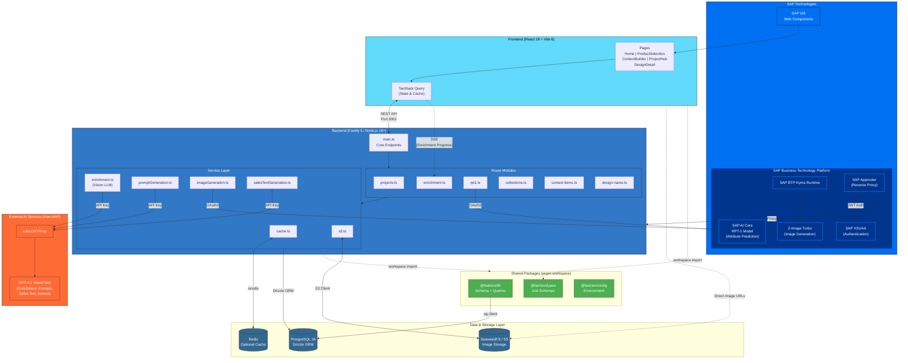
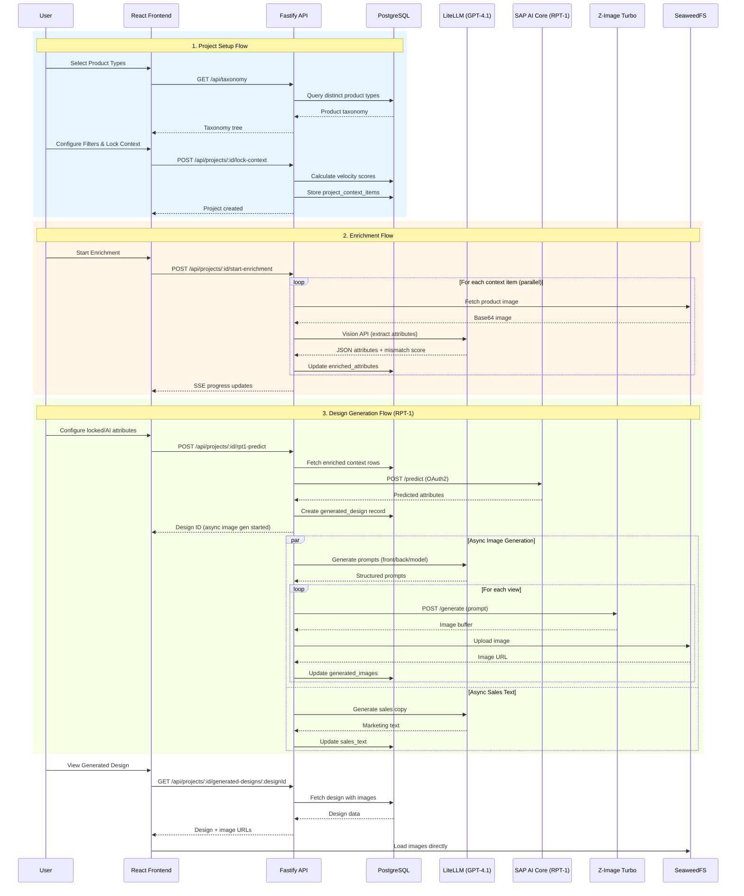

# Technical Architecture: Fashion Trend Alchemist

## Project Summary

**Fashion Trend Alchemist** is an AI-powered fashion analytics platform built as a **pnpm monorepo**. It analyzes historical product/sales data to identify trends and uses **inverse design** capabilities powered by SAP AI Core's RPT-1 model to predict optimal design attributes for future best-sellers. The platform also generates product visualizations using a custom image generation API.

---

## High-Level Technical Overview

### What the System Does

The Fashion Trend Alchemist solves a unique problem in fashion retail: instead of predicting how well existing products will sell, it works backwards to generate the _design attributes_ of products that would sell well. This "inverse design" approach combines historical sales analysis with AI-powered attribute prediction and visualization.

The system ingests the H&M fashion dataset containing ~105,000 articles with attributes (color, pattern, style, fabric) and ~31 million sales transactions. Users define a "context cohort" by selecting product types and time periods, then the system identifies top and bottom performers based on sales velocity. A Vision LLM extracts detailed design attributes from product images, and finally, SAP AI Core's RPT-1 model predicts optimal attribute combinations for new designs targeting a specific success level.

### Architecture Philosophy

The application follows a **modern full-stack TypeScript architecture** with strict type safety across all layers. The pnpm monorepo structure allows shared code (types, database schemas, configuration) to be consumed by both frontend and backend without duplication. This ensures that API contracts, database models, and validation schemas stay synchronized.

The backend uses **Fastify** for its exceptional JSON serialization performance and plugin architecture. Routes are organized into modular files by domain (projects, enrichment, RPT-1, collections), with business logic extracted into dedicated service modules. This separation keeps route handlers thin and testable.

The frontend is a **React single-page application** built with Vite for fast development iteration. SAP UI5 Web Components provide enterprise-grade UI elements with SAP's design language, while TanStack Query manages server state with built-in caching, deduplication, and background refetching.

### Data Flow Architecture

Data flows through the system in distinct phases:

**Phase 1 - Context Definition**: Users browse a hierarchical product taxonomy and select target product types. They configure filters (season, color family, pattern) to narrow the cohort. The system calculates "velocity scores" for each matching article - a metric combining sales volume with availability period to measure sales performance fairly.

**Phase 2 - Data Enrichment**: The top 25 and bottom 25 articles by velocity are locked into the project context. A Vision LLM (GPT-4.1) processes each article's product image to extract structured attributes based on an LLM-generated ontology schema. This enrichment runs in parallel with configurable concurrency, reporting progress via Server-Sent Events. The Vision LLM also detects potential product type mismatches (e.g., an image labeled "skirt" that actually shows pants).

**Phase 3 - Inverse Design**: Users configure which attributes to "lock" (fixed values) and which to let the AI predict. The enriched context data, along with velocity scores, feeds into SAP AI Core's RPT-1 model. RPT-1 analyzes patterns between attribute combinations and success scores, then predicts optimal values for the unlocked attributes to achieve a target success level.

**Phase 4 - Visualization**: The system generates three product images (front view, back view, model/lifestyle) using Z-Image Turbo. An LLM first generates structured prompt components ensuring visual consistency across views - all three images share an identical product description. Images upload to SeaweedFS/S3 storage, and the system generates marketing sales copy in parallel.

### External Service Integration

The system integrates with multiple AI services, each accessed via OAuth2 authentication with 11-hour token caching:

- **LiteLLM Proxy**: Routes requests to GPT-4.1 for ontology generation, attribute extraction (Vision), prompt generation, and sales text creation
- **SAP AI Core**: Hosts the RPT-1 model for statistical attribute prediction based on context patterns
- **Z-Image Turbo**: Generates fashion product images from text prompts with consistent quality

### Database Design

PostgreSQL stores both static reference data (H&M articles, transactions, customers) and dynamic application state (projects, enriched attributes, generated designs). The schema uses JSONB columns extensively for flexible, schema-less data like ontology definitions, enriched attributes, and multi-image status tracking.

Key performance optimizations include composite indexes on frequently filtered columns, a covering index for filter queries, and functional indexes for date-based filtering. An optional Redis layer provides 15-30x faster response times for repeated queries.

### Caching Strategy

The system implements multi-level caching:

- **Redis (Backend)**: Caches filter options (15 min TTL), product listings (5 min TTL), and taxonomy data. Cache keys are generated from query parameter hashes for efficient invalidation.
- **TanStack Query (Frontend)**: Manages client-side cache with configurable stale times. Queries deduplicate automatically, and background refetching keeps data fresh without blocking the UI.
- **OAuth Token Cache**: External API tokens cache for 11 hours (tokens valid for 12 hours) to minimize authentication overhead.

### Real-Time Communication

Long-running operations use different real-time strategies:

- **Enrichment Progress**: Server-Sent Events (SSE) stream progress updates as each article is processed. The frontend displays a progress bar with current article ID.
- **Image Generation**: The frontend polls the image status endpoint every 5 seconds until all three views complete. Each view has independent status tracking (pending → generating → completed/failed).

### Error Handling and Resilience

The system implements retry logic with exponential backoff for external API calls. Vision LLM enrichment retries failed items up to 3 times. Image generation retries once per view. If prompt generation via LLM fails twice, the system falls back to template-based prompt generation using the same category and model profile logic.

Failed enrichment items are tracked individually, allowing users to retry specific failures without reprocessing successful items. Project-level status tracks overall enrichment state (idle, running, completed, failed).

---

## Tech Stack

| Layer               | Technology                                                           |
| ------------------- | -------------------------------------------------------------------- |
| **Frontend**        | React 18, Vite 6, TypeScript, SAP UI5 Web Components, TanStack Query |
| **Backend**         | Node.js 18+, Fastify 5, TypeScript (ESM)                             |
| **Database**        | PostgreSQL 16 (cloud-hosted)                                         |
| **ORM**             | Drizzle ORM 0.29.5                                                   |
| **Caching**         | Redis (ioredis)                                                      |
| **AI/ML**           | GPT-4.1 via LiteLLM proxy, SAP AI Core RPT-1, Z-Image Turbo          |
| **Storage**         | S3/SeaweedFS for generated images                                    |
| **Package Manager** | pnpm 8+ with workspaces                                              |

---

## Monorepo Structure

```
fashion-trend-alchemist/
├── apps/
│   ├── api-lite/          # Fastify REST API server
│   │   ├── src/
│   │   │   ├── main.ts            # Entry point, core endpoints
│   │   │   ├── routes/            # Modular route handlers
│   │   │   │   ├── projects.ts
│   │   │   │   ├── enrichment.ts
│   │   │   │   ├── rpt1.ts
│   │   │   │   ├── collections.ts
│   │   │   │   └── ...
│   │   │   └── services/          # Business logic services
│   │   │       ├── cache.ts           # Redis caching
│   │   │       ├── enrichment.ts      # Vision LLM processing
│   │   │       ├── imageGeneration.ts # Z-Image API integration
│   │   │       ├── promptGeneration.ts # LLM prompt assembly
│   │   │       ├── salesTextGeneration.ts
│   │   │       └── s3.ts              # Object storage
│   └── web/               # React SPA frontend
│       └── src/
│           ├── pages/             # Route-based pages
│           ├── components/        # Reusable UI components
│           ├── services/api/      # API client layer
│           └── hooks/             # Custom React hooks
├── packages/
│   ├── db/                # Database layer
│   │   └── src/
│   │       ├── client.ts          # PostgreSQL connection (pg)
│   │       ├── schema/            # Drizzle table schemas
│   │       └── queries/           # Query functions
│   ├── types/             # Shared TypeScript types + Zod schemas
│   └── config/            # Environment configuration
└── pnpm-workspace.yaml    # Workspace definition
```

---

## Key Data Flows

### 1. Product Selection → Context Building → Enrichment

- User selects product types from taxonomy
- Configures filters (season, attributes)
- System calculates velocity scores (sales/availability)
- Locks context and creates project

### 2. Vision LLM Enrichment Pipeline

- Processes product images in parallel (configurable concurrency)
- Extracts ontology attributes via GPT-4.1 Vision
- Detects product type mismatches with confidence scores

### 3. RPT-1 Inverse Design Flow

- User locks specific attributes, marks others for AI prediction
- Builds context rows from enriched data + velocity scores
- Calls SAP AI Core RPT-1 API for attribute prediction
- Generates 3 product images (front/back/lifestyle) via Z-Image Turbo

### 4. Image Generation Pipeline

- Prompt generation via LLM (component-based for consistency)
- Sequential generation: front → back → model views
- Upload to SeaweedFS/S3
- Async status updates to database

---

## Database Schema (Core Tables)

| Table                   | Purpose                                                            |
| ----------------------- | ------------------------------------------------------------------ |
| `articles`              | Product catalog with attributes (color, pattern, style, etc.)      |
| `transactions_train`    | Historical sales data (article_id, date, price)                    |
| `customers`             | Customer demographics                                              |
| `projects`              | User projects with scope, ontology schema, enrichment tracking     |
| `project_context_items` | Per-project article data with velocity scores, enriched attributes |
| `generated_designs`     | AI-generated designs with images, prompts, sales text              |
| `collections`           | User-curated design collections                                    |

---

## External Integrations

| Service           | Purpose                                                 | Authentication            |
| ----------------- | ------------------------------------------------------- | ------------------------- |
| **LiteLLM Proxy** | Vision LLM (GPT-4.1) for attribute extraction & prompts | API Key                   |
| **SAP AI Core**   | RPT-1 model for attribute prediction                    | OAuth2 Client Credentials |
| **Z-Image Turbo** | Fashion image generation                                | OAuth2 Client Credentials |
| **SeaweedFS/S3**  | Object storage for generated images                     | AWS S3 credentials        |
| **Redis**         | Optional caching layer                                  | Connection URL            |

---

## Architecture Diagram



### SAP Technologies Used

| Technology | Purpose | Layer |
|------------|---------|-------|
| **SAP UI5 Web Components** | Enterprise UI component library with SAP Fiori design | Frontend |
| **SAP AI Core** | ML platform hosting RPT-1 model for attribute prediction | AI/ML |
| **SAP BTP Kyma Runtime** | Kubernetes-based runtime for Z-Image Turbo microservice | Infrastructure |
| **SAP XSUAA** | OAuth2 authentication service (production) | Security |
| **SAP Approuter** | Reverse proxy handling auth and routing (production) | Infrastructure |
```

---

## Detailed Component Flow Diagram



---

## Key Architectural Patterns

### 1. Monorepo with Workspace Packages

Shared code via `@fashion/db`, `@fashion/types`, `@fashion/config` using pnpm workspace protocol.

### 2. Layered API Architecture

Routes → Services → Database with clear separation of concerns.

### 3. Async Background Processing

Image/text generation runs asynchronously after returning design ID to client.

### 4. Component-Based Prompt Generation

LLM generates reusable prompt components (productDescription, viewPrefix, etc.) ensuring visual consistency across image views.

### 5. OAuth2 Token Caching

11-hour token cache for external APIs to minimize auth overhead.

### 6. SSE for Progress Tracking

Server-Sent Events for real-time enrichment progress updates.

### 7. Optimistic UI with Status Polling

Frontend polls for async operation completion (image generation).

---

## Environment Variables

Key configuration (see `.env.example` for full list):

```bash
# Database
PGHOST, PGPORT, PGDATABASE, PGUSER, PGPASSWORD

# API Server
API_PORT=3001
API_HOST=0.0.0.0

# Redis (optional)
REDIS_URL=redis://localhost:6379

# LLM Integration
LITELLM_PROXY_URL, LITELLM_API_KEY, VISION_LLM_MODEL

# SAP AI Core (RPT-1)
AI_API_URL, AUTH_URL, CLIENT_ID, CLIENT_SECRET, RESOURCE_GROUP

# Image Generation
IMAGE_GEN_TOKEN_URL, IMAGE_GEN_CLIENT_ID, IMAGE_GEN_CLIENT_SECRET, IMAGE_GEN_API_URL

# S3/SeaweedFS
S3_ENDPOINT, S3_REGION, S3_ACCESS_KEY_ID, S3_SECRET_ACCESS_KEY, S3_BUCKET
```

---

## Development Commands

```bash
# Start both API and web app
pnpm run dev

# Start individually
cd apps/api-lite && pnpm run dev  # Port 3001
cd apps/web && pnpm run dev       # Port 5173

# Build all packages
pnpm build

# Database operations
pnpm db:generate   # Generate migrations
pnpm db:migrate    # Apply migrations
pnpm db:studio     # Open Drizzle Studio GUI

# Format code
pnpm format
```
